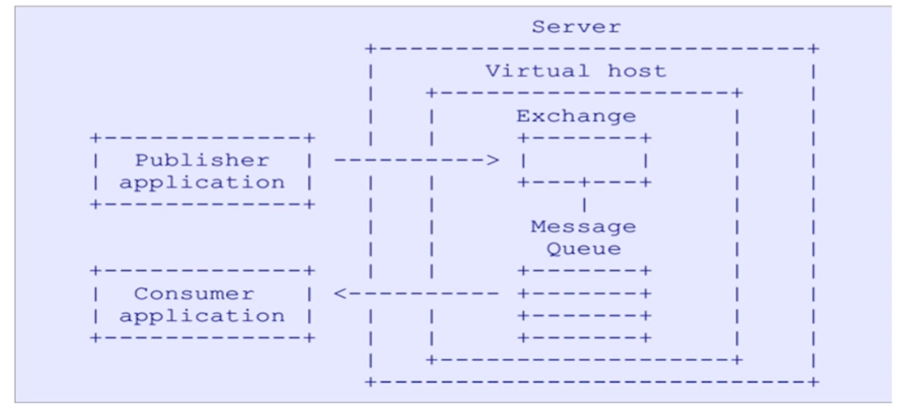
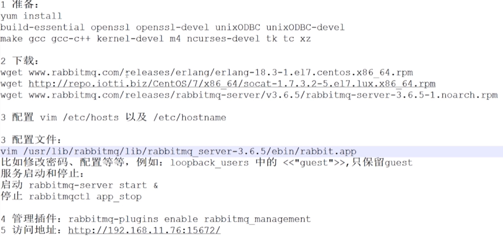

# 目录

[toc]

---

# 什么是 RabbitMQ

[link](https://www.imooc.com/video/17842)
- RabbitMQ 是一个开源的消息代理和队列服务器，是一个数据共享的中间件。
- 通过普通协议，在完全不同的应用之间共享数据。
- RabbitMQ 底层是通过 Erlang 语言编写的
- RabbitMQ 是基于 AMQP 协议的


## 优点

- 目前很多大厂都在使用 RabbitMQ
- 开源、性能优秀、稳定性保障
- 与 SpringAMQP 完美的整合、API 丰富
- 集群模式丰富，表达式丰富，HA 模式，镜像队列模型
- 保证数据不丢失的前提下，做到高可靠性、可用性


## AMQP 协议

协议，即定义的一套规范。
AMQP 全称 Advanced Message Queuing Protocol，翻译即 **==高级消息队列协议==**。

### 什么是消息队列

- 消息队列 (Message Queuing) 是一种应用间的通信方式，消息发送后可以立即返回。
- 有消息系统来确保信息的可靠传递
- ==消息发布者只管发布信息到 MQ 中不管谁来取，消息使用者只管从 MQ 中取消息不管是谁发布的==。双方都不知道对方的存在


### AMQP 协议模型

```py
Publisher application   : 消息生产者
Consumer application    : 消息消费者
Server                  : RabbitMQ 服务端
Virtual host            : 虚拟主机
Exchange                : 交换机   （与 Message Queue 有绑定关系
Message Queue           : 消息队列 
```


[讲解 4:23](https://www.imooc.com/video/17842) 

生产者只需要把消息投递到 Server 上 Virtual host, Exchange 就可以了，
消费者只需要与 Message Queue 进行绑定监听，
从而 **<u>==实现 生产者 与 消费者 之间队列的解耦==</u>**，即生产者不需要关心我需要把消息投递到哪个队列，消费者只需要监听队列即可。

注意，<u>**Exchange 与 Message Queue 是通过路由 url 绑定的**</u>

<br>

# RabbitMQ 安装

[官网](http://www.rabbitmq.com/)


- **安装步骤** （[讲解 00:53](https://www.imooc.com/video/17843) 




## docker 安装
[官网](https://www.rabbitmq.com/download.html)

拉取并运行镜像：
```
docker run -it --rm --name rabbitmq -p 5672:5672 -p 15672:15672 rabbitmq:3-management
```
management 会带有管理界面
如果是阿里云服务器，记得到阿里云控制台开启 15672 端口


<br>

<u></u>


还没学完 未完待续。。
可用的学习博客：
https://www.cnblogs.com/sgh1023/p/11217017.html
https://www.cnblogs.com/williamjie/p/9481774.html
https://www.cnblogs.com/shenh/p/10497244.html