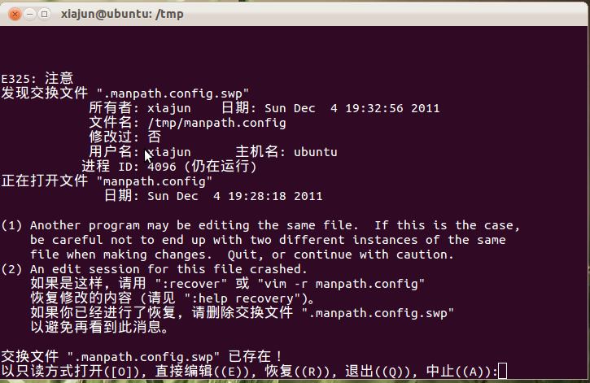
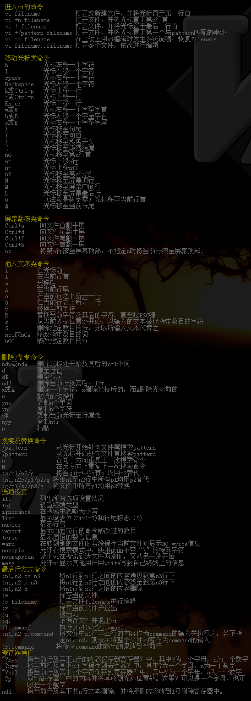

[转载！文章出处](https://blog.csdn.net/yangshuainan/article/details/78219604)

# 目录

[toc]

---

# vi与vim
vi编辑器是所有Unix及Linux系统下标准的编辑器，他就相当于windows系统中的记事本一样，它的强大不逊色于任何最新的文本编辑器。他是我们使用Linux系统不能缺少的工具。由于对Unix及Linux系统的任何版本，vi编辑器是完全相同的，学会它后，您将在Linux的世界里畅行无阻。
vim 具有程序编辑的能力，可以以字体颜色辨别语法的正确性，方便程序设计；
因为程序简单，编辑速度相当快速。
**vim可以当作vi的升级版本**，他可以用多种颜色的方式来显示一些特殊的信息。
vim会依据文件扩展名或者是文件内的开头信息， 判断该文件的内容而自动的执行该程序的语法判断式，再以颜色来显示程序代码与一般信息。
vim里面加入了很多额外的功能，例如支持正则表达式的搜索、多文件编辑、块复制等等。 这对于我们在Linux上进行一些配置文件的修改工作时是很棒的功能。

## 为何要学 vi
所有的Unix Like系统都会内建vi文本编辑器，其他的文本编辑器则不一定会存在；
一些软件的编辑接口会主动调用vi (例如 crontab, visudo, edquota 等命令)；

# vi 的使用
基本上vi可以分为三种状态，分别是
- 一般模式 
- 编辑模式 INSERT
- 命令行模式 

各模式的功能区分如下：

## 编辑模式 INSERT
在一般模式中可以进行删除、复制、粘贴等的操作，但是却无法编辑文件的内容，只有当到你按下 **`i, I, o, O, a, A, r, R`** 等任何一个字母之后才会进入编辑模式。这时候屏幕的左下方会出现 **`INSERT或 REPLACE`** 的字样，此时才可以进行编辑。而如果要回到一般模式时， 则必须要按下 **`Esc`** 即可退出编辑模式。


## 命令行模式
输入 **` : / ? `** 三个中的任何一个，就可以将光标移动到最底下那一行。在这个模式中， 可以提供 **<u>查找、读取、存盘、替换字符、离开vi、显示行号</u>** 等的动作则是在此模式中完成的！


## 一般模式
可用的按钮说明

### 移动光标
 **`h、j、k、l`** ，分别控制光标左、下、上、右移一格
按 **`ctrl+b`** 屏幕往"后"移动一页
按 **`ctrl+f`** 屏幕往"前"移动一页

 **`n<space>`** 光标向右移动n个字符
 **`Home`** 移动到这一行的最前面字符处:0数字，但不能用数字小键盘上的数字
 **`End`**  移动到这一行的最后面字符处:$，我测试好像不行
 **`w`** 光标跳到下个字的开头
 **`e`** 光标跳到下个字的字尾

 **`H`**  光标移动到这个屏幕的最上方那一行的第一个字符
 **`M`**  光标移动到这个屏幕的中间那一行的第一个字符
 **`L`** 光标移动到这个屏幕的最下方那一行的第一个字符

 **`G`**  移动到这个文件的最后一行
 **`nG`** 移动到这个文件的第n行(可配合:set nu)
 **`gg`**  移动到这个文件的第一行，相当于1G
 **`n<Enter>`** 光标向下移动n行


### 查找与替换
 **`/word`**  向光标向下寻找一个名称为word的字符串
 **`?word`**  向光标向上寻找一个名称为word的字符串
 **`n`**  代表重复前一个查找的动作
 **`N`**  与n刚好相反，为 **`反向`** 进行行前一个查找动作

 **`:n1,n2s/word1/word2/g`**   n1与n2为数字，在第n1与n2行之间查找word1 这个字符串，并将该字符串替换为word2

 **`:1,$s/word1/word2/g`**  从第一行到最后一行查找word1字符串，并将该字符串替换为word2
 **`:1,$s/word1/word2/gc`**  从第一行到最后一行查找word1字符串，并将该字符串替换为word2 ，且在替换前提示用户确认是否进行替换

#### 1）全匹配

1，从上往下查找，比如“string” ：   **`/string`**
2，从下往上查找，比如“string” ： **`?string `**

 

#### 2）模糊匹配（正则表达式）

1，**`.`** ：通配1个字符 ，如 匹配 `server`, 可以用  `/se...r`
2，**`*`** ：通配多个字符，如 匹配 `privilege` ，可以用 `p*ge`

 

#### 3）快速查找

##### **快速选中单词**
1， **`Shift + *`** / **`Shift + #`** ：让光标停留在想要查找的单词的任意一个字母上面， 然后输入 Shift + * ，即可快速选中该单词，并且通过 **`n`**  或  **`N`** 进行上一个或下一个的匹配。

2，**`yw`** ：让光标停留在单词的第一个字母上， 
然后输入 yw 拷贝该单词， 然后输入 **`/ (Ctrl + R) 0 （即 /”0）`**，回车， 
就查找到了第一个匹配的单词， 并且通过 **`n`**  或  **`N`** 进行上一个或下一个的匹配。
<br>

### 删除、复制与粘贴

 **`x`**  为向后删除一个字符 (相当于 **`del`** 键)
 **`X`**  为向前删除一个字符(相当于 **`backspace`** 键)
 **`nx`**  连续向后删除n个字符

 **`dd`**  删除光标所在行
 **`ndd`**  删除光标所在的向下n行
 **`d1G`**  删除光标所在行到第一行的所有数据
 **`dG`**  删除光标所在到最后一行的所有数据

 **`d$`**  删除光标所在处，到该行的最后一个字符
 **`d0`**  删除光标所在处，到该行的最前一个字符

 **`yy`**  复制光标所在的那一行
 **`nyy`**  复制光标所在的向下n列

 **`y1G`**  复制光标所在行到第一行的所有数据
 **`yG`**  复制光标所在行到最后一行的所有数据

 **`y0`**  复制光标所在的那个字符到该行行首的所有数据
 **`y$`**  复制光标所在的那个字符到该行行尾的所有数据

 **`p`** 将已复制的数据在光标下一行粘贴上
 **`P`**  则为贴在光标的上一行

 **`u`**  恢复前一个操作
 **`Ctrl+r`** 重做上一个操作

 **`.`**  是重复前一个操作


## 一般模式切换到其他模式

### 切换到编辑模式
 **`i, I`**  进入编辑模式：
i 为 **`从目前光标所在处插入`** 
I 为 **`在目前所在行的第一个非空格符处开始插入`** 
 
 **`a, A`**  进入编辑模式(Insert mode)：
a 为 **`从目前光标所在的下一个字符处开始插入`** 
A 为 **`从光标所在行的最后一个字符处开始插入`** 

 **`o, O`**  进入编辑模式：
o 为 **`在目前光标所在的下一行处插入新的一行`** 
O 为在目前光标所在处的上一行插入新的一行

 **`r, R`**  进入取代模式：
r 只会取代光标所在的那一个字符一次
R会一直取代光标所在的文字，直到按下 ESC 为止；

 **`Esc`**  退出编辑模式，回到一般模式


## 切换到命令行模式

 **`:w`**  保存编辑的内容
 **`:w!`** 强制写入该文件，但跟你对该文件的权限有关
 **`:q`**  离开vi
 **`:q!`**  不想保存修改强制离开
 **`:wq`**  保存后离开
 **`:x`**  保存后离开
 **`ZZ`**  若文件没有更动，则不保存离开，若文件已经被更改过，则保存后离开

 **`:w filename`**  将编辑的数据保存成另一个文件（类似另存）
 **`:r filename`**  在编辑的数据中，读入另一个文件的数据。即将 **`filename`**  这个文件的内容加到光标所在行后面。

 **`:n1,n2 w filename`**  将n1到n2的内容保存成filename这个文件。
 **`:! command`** 暂时离开vi 到命令行模式下执行command的显示结果！例如  **`:! ls /home`** 即可在 vi 当中察看/home底下以ls输出的文件信息！

 **`:set nu`**  显示行号
 **`:set nonu`**  与 set nu 相反，为取消行

<br>


## vim的缓存文件、恢复与开启时的警告信息

我们知道一些常用的编辑软件，都有个恢复的功能，就是说当你的系统因为某些原因而导致类似当机的情况时，还可以利用这个恢复功能将之前未保存的数据找回来。我们的VIM也有这个功能。

当我们在使用vim编辑时，vim会在与被编辑的文件的目录下，再建立一个名为 **`.filename.swp`** 的文件。如果你的系统因为某些原因断线了， 导致你编辑的文件还没有保存，这个时候 `.filenam.swp` 就能够发会救援的功能了。

我们来演示一下
```
vim man.config
ctrl+z放到后台执行
我们停止VI的进程
一种方法
ps aux |grep vi
kill -9 n

另外一种方法
jobs
kill -9 %1
```

我们用ls -l 命令来查看一下目录里面，会发现有个`.man.config.swp`的文件，这个文件就是个缓存的文件

我们再来编辑
`vim man.config`
这时候会出现一些信息


问题一：可能有其他人或程序同时在编辑这个文件：
问题二：在前一个vim的环境中，可能因为某些不知名原因导致vim中断 (crashed)：

右下角会出现六个命令项，其作用说明如下：
(**`O`**)pen Read-Only：打开此文件成为只读档， 可以用在你只是想要查阅该文件内容并不想要进行编辑行为时。一般来说，在上课时，如果你是登入到同学的计算机去看他的配置文件， 结果发现其实同学他自己也在编辑时，可以使用这个模式；
(**`E`**)dit anyway：还是用正常的方式打开你要编辑的那个文件， 并不会载入暂存盘的内容。如果说两个人都在编辑这个文件的话，很容易出现互相改变对方的文件等问题。
(**`R`**)ecover：就是加载暂存盘的内容，用在你要救回之前未保存的工作。 不过当你救回来并且储存离开vim后，还是要手动自行删除那个暂存档。
(**`D`**)elete it：你确定那个暂存档是无用的！那么开启文件前会先将这个暂存盘删除
(**`Q`**)uit：按下 q 就离开vim，不会进行任何动作回到命令提示字符。
(**`A`**)bort：忽略这个编辑行为，感觉上与 quit 非常类似！


---

# vim 的功能
其实，目前大部分的Linux发行版本都以vim取代了vi。
为什么要用vim呢？
因为vim具有颜色显示的功能，并且还支持许多的程序语法(syntax)和相应的提示信息。
查看自己的VI是不是被VIM代替，可以用alias这个命令来查看是不是有alias vi=’vim’这一行。

## 块选择
 **`v`** ：字符选择，会将光标经过的地方反白选择
 **`V`**  ：行选择，会将光标经过的行反白选择
 **`Ctrl+v`**  ：块选择，可以用长方形的方式选择资料 （提制竖列）
 **`y`**  ：将反白的地方复制
 **`d`**  ：将反白的地方删除


## 多文件编辑

大家在使用vim的时候，可能会碰到你需要复制一个文件中的某段到另外一个文件中，而vim不能够在关闭的时候，把这段保留住。
或者是用其它的方法复制。 

我们在两个或多个文件之间复制粘贴内容时，这个功能会让我们方便很多。

使用命令 **`vim name1 name2 name3...`** (各个文件名之间用空格隔开)可以同时打开多个文件。

 **`:n`** 编辑下一个文件
 **`:N`** 编辑上一个文件
 **`:files`** 列出目前这个vim编辑的所有文件


## 多窗口功能
有两个需要对照着看的文件
 **`:sp filename`** 开启一个新窗口，如果有加 filename， 表示在新窗口开启一个新文件，否则表示两个窗口为同一个文件内容(同步显示)。

 **`ctrl+w+j`** 
 **`ctrl+w+↓`** 按键的按法是：先按下  **`ctrl`**  不放， 再按下 w 后放开所有的按键，然后再按下 j (或向下箭头键)，则光标可移动到下方的窗口。

 **`ctrl+w+k`** 
 **`ctrl+w+↑`** 同上，不过光标移动到上面的窗口。


## vim 环境设定与记录

**`~/.vimrc`**, **`~/.viminfo`**

如果我们以vim软件来查找一个文件内部的某个字符串时，这个字符串会被反白， 而下次我们再次以vim编辑这个文件时，该查找的字符串反白情况还是存在。另外，当我们重复编辑同一个文件时，当第二次进入该文件时， 光标竟然就在上次离开的那一行的开头。这个功能可能是方便，但也有不方便的时候。怎么会这样呢？这是因为我们的vim会主动的将你曾经做过的行为登录下来，那个记录动作的文件就是： `~/.viminfo`，不想用这个功能，就直接删除`~/.viminfo`。只要你曾经使用过vim，那么你的家目录就会有这个文件。这个文件是自动产生的，你在vim里头所做过的动作，就可以在这个文件内部找到。有兴趣的朋友可以自己查看文件里面的内容。

不过，对于每个不同的发行版本对vim的预设环境都不太相同。举例来说，某些版本在查找到关键词时并不会高亮度反白， 有些版本则会主动的帮你进行缩排（所谓的缩排，就是当你按下 Enter 编辑新的一行时，光标不会在行首，而是在与上一行的第一个非空格符处对齐）的行为。其实这些都可以自行设定的，下面我们就来看看vim的环境设定。
vim的环境设定参数有很多，如果你想要知道目前的设定值，可以在一般模式时输入 **` :set all`** 来查阅，由于设定项目实在太多了，我们在这里就仅列出一些平时比较常用的一些简单的设定值，给大家提供参考。

`set all` "显示目前所有的环境参数设定值
`set hlsearch` "高亮度反白(高亮度搜寻)
`set nohlsearch` "取消高亮度反白(高亮度搜寻)
`set backspace=2` "在编辑的时候可随时用退格键删除 （０、１的时候，只针对刚输入的字符有效）
`set autoindent` "自动缩排
`set noautoindent` "取消自动缩排
`set ruler` "可显示最后一行的状态
`set showmode` "左下角那一行的状态
`set nu` "显示行号
`set nonu` "取消行号
`set bg=dark` "显示不同的底色色调
`syntax on` "进行语法检验，颜色显示
`syntax off` "关闭语法检验

了解完上面的内容后，下面我们就能写一下自己的vim操作环境。
整体vim的设定值一般是置在`/etc/vimrc`这个文件里面，不建议大家来修改他。我们在自己的家目录里面建立个.vimrc文件，在这里面写入自己的内容就能实现了。
```
[root@yufei ~]# vim ~/.vimrc
# 内容如下
set hlsearch "高亮度反白
set backspace=2 "可随时用退格键删除
set autoindent "自动缩排
set ruler "可显示最后一行的状态
set showmode "左下角那一行的状态
set nu "可以在每一行的最前面显示行号
set bg=dark "显示不同的底色色调
syntax on "进行语法检验，颜色显示
"这个文件的双引号 (")表示的是注释
```

保存退出vim后，在下次使用vim的时候，就会有自己的vim操作环境了。
提醒一点，这个文件中每一行前面加不加 **`:`** 效果都是一样的。


## vim 键盘图

最后，给也几张不错的图，帮助大家更快的来掌握vi/vim，记住一点，不要死记，重在操作


## vim 命令图解



