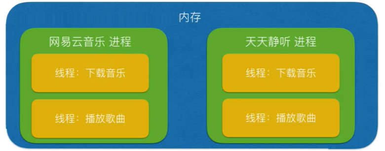

[toc]

---


## 进程

[link 00:20](https://www.bilibili.com/video/BV1zb411h7Yy?p=15)
双击一个程序之后，运行起来之后，就是一个进程。
进程，是一堆资源的总称。包括代码、内存、显示器、摄像头、网络、硬盘等。所有东西都包括


## 线程

线程也能完成多任务，但是线程比较轻量级


### 那么线程跟进程的区别是什么？

你同时开启的多个远程 APP 就是多个进程，一个 APP 一个进程，进程是资源的总称，即这个 APP 中的摄像头、网络、内存、代码等等。

而我在一个 APP 中实现的多任务，这就是线程。

一个进程中至少有一个主线程在控制资源（或者控制子线程）


**总结：**
进程：是资源分配的单位（一个进程需要分配资源）
线程：是将来操作系统调度的单位


[进程线程区别 的生动举例 08:50~12:12](https://www.bilibili.com/video/BV1zb411h7Yy?p=15)
可以将进程理解为工厂中的一条流水线，而其中的线程就是这个流水线上的工人
</img>


[进程线程区别 的生动举例 14:04](https://www.bilibili.com/video/BV1zb411h7Yy?p=15)
</img>

进程的资源太浪费拉，线程要比进程轻，多数的多任务用线程就足够了


实现多任务的方式有两种
1. 一个进程中有 主线程+多个子线程
2. 多个进程，每个进程中都有一个主线程


## 协程

[00:58](https://www.bilibili.com/video/BV1zb411h7Yy?p=27)
执行这段代码，体会一些协程的切换有多快，
==**协程调用一个任务，就像调用一个子函数一样**==。

通过 yield 执行线程，只在一个线程之中，通过 yield 控制执行的协程，一会执行一个协程任务，一会执行另一个协程任务。只要没有延时，最后的效果就像两个 while True 一起在切换执行
```py
import time

def task1():
    '''任务一'''
    while True:
        print("-----1------")
        time.sleep(0.1)
        yield


def task2():
    '''任务二'''
    while True:
        print("-----2------")
        time.sleep(0.1)
        yield


def main():
    '''调度函数'''
    t1 = task1()
    t2 = task2()
    while True:
        next(t1)
        next(t2)


if __name__ == "__main__":
    main()
```
现在要执行很多任务
并行：有 4 个 CPU 核，一个任务占一个核
并发：有 2 个 CPU 核，同时执行很多任务，交替执行


[使用协程，与进程线程相比的优势在哪里？06:30](https://www.bilibili.com/video/BV1zb411h7Yy?p=27)

- 进程之间切换任务占用资源很大。且创建一个进程，要从硬盘上加载代码、申请内存空间等等。创建进程、释放进程占用大量时间。
- 进程占用资源浪费，线程次之。而比线程占用资源更加小的是协程。
协程调用一个任务，就像调用一个子函数一样


