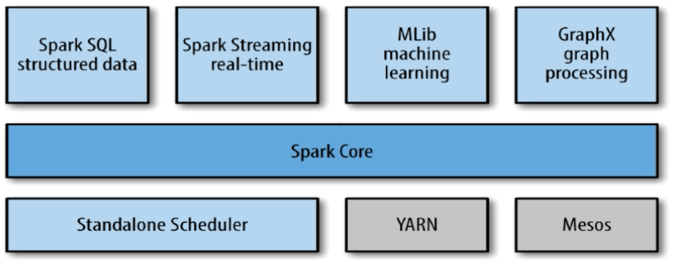

[toc]

---

爽了爽了，就等我的升降椅了，然后我书桌就完美了


# spark

[source](https://www.imooc.com/video/14388)

# spark 是什么

spark 是一个 **快速** 且 **通用** 的集群计算平台


## Spark 的特点

- <b style="color:blue">Spark 是快速的</b>
  - Spark 扩充了流行的 Mapreduce 计算模型 
  - Spark 是 **基于内存** 的计算
    (比如我们在处理大批量的数据时，难免会产生一些中间的数据，**这些中间的数据如果储存在磁盘就会有一些写入写出的操作影响性能**，而 ==Spark 会将这些数据储存在内存中==，以此来提升性能）
- <b style="color:blue">Spark 是通用的</b>
    - Spark 的设计容纳了其它分布式系统拥有的功能
    批处理，迭代式计算，交互查询和流处理等
    优点：降低了集群的维护成本
- <b style="color:blue">Spark 是高度开放的</b>
Spark 提供了 Python, Java, Scala, SQL 的 API 和丰富的内置库。
Spark 和其它的大数据工具整合的很好，包括 hadoop, kafka 等

  
# spark 生态介绍

## Spark 历史
诞生于 2009 年，加州大学伯克利分校 RAD 实验室的一个研究项目
最初是基于 Hadoop Mapreduce 的
发现 **Mapreduce 在迭代式计算和交互式上低效，引入了 ==内存存储==**

2010 年 3 月份 Spark 开源
2011 年 AMP 实验室在 Spark 上开发高级组件，像 Spark Streaming
2013 年转移到了 Apache 下，不久便成为顶级项目了

## Spark 的组件
Spark 包括多个紧密集成的组件

</img>

<b style="color:blue;font-family:consola;font-size:14px;">Spark Core：</b>
- 包含 Spark 的基本功能，包含任务调度，内存管理，容错机制等。
- 内部定义了 RDDs （弹性分布式数据集）。
- 提供了很多 APIs 来创建和操作这些 RDDS.
- 应用场景，为其他组件提供底层的服务。

<b style="color:blue;font-family:consola;font-size:14px;">Spark SQL：</b>
- 是 Spark 处理结构化数据的库，就像 Hive SQL, Mysql 一样。
- 应用场景，企业中用来做报表统计

<b style="color:blue;font-family:consola;font-size:14px;">Spark Streaming：</b>
- 是实时数据流处理组件，类似 Storm
- Spark Streaming 提供了 API 来操作实时流数据。
- 应用场景，企业中用来从 Kafka 接收数据做实时统计。

<b style="color:blue;font-family:consola;font-size:14px;">Mlib：</b>
- 一个包含通用机器学习功能的包， Machine learning lib.
- 包含分类，聚类，回归等，还包括模型评估，和数据导入。
- Mlib 提供的上面这些方法，都支持集群上的横向扩展。
- 应用场景，机器学习。

<b style="color:blue;font-family:consola;font-size:14px;">Graphx：</b>
- 是处理图的库（例如，社交网络图），并进行图的并行计算。
- 像 Spark Streaming, Spark SQL 样 它也継承了 RDD API 。
- 它提供了各种图的操作，和常用的图算法，例如 PangeRank 算法。
- 应用场景，图计算。

<b style="color:blue;font-family:consola;font-size:14px;">Cluster Managers：</b>
- 就是集群管理， Spark 自带一个集群管理是单独调度器。
- 常见集群管理包括 Hadoop YARN, Apache Mesos

##紧密集成的优点
- Spark 底层优化了，基于 Spark 底层的组件，也得到了相应的优化
- 紧密集成，节省了各个组件组合使用时的部署，测试等时间。
- 向 Spark 增加新的组件时，其它组件，可立刻享用新组件的功能。


# Spark 与 Hadoop 的比较
[link](https://www.imooc.com/video/14393)

- **Hadoop 应用场景**

离线处理
对时效性要求不高

- **Spark 应用场景**

时效性要求高的场景 （基于内存，**==中间的处理数据尽量不会落在硬盘上==**）
机器学习等领域 （迭代计算）
<br>

<b style="font-size:20px;">Doug Cutting 的观点：</b>
- 这是生态系统，每个组件都有其作用，各善其职即可
- Spark 不具有 HDFS 的存储能力，要借助 HDFS 等持久化数据。
- 大数据将会孕育出更多的新技术


# Spark 安装
[link](https://www.imooc.com/video/14394)

<b style="font-size:20px;">Spark 运行环境：</b>

Spark 是 Scala 写的，运行在 JVM 上，所以运行环境数 **Java7+** 。
如果使用 Python API ，需要安装 Python2.6+ 或者 Python3.4+ 。

下面是 spark 与 Scala 的版本对应关系：
`Spark 1.6.2` - `scala 2.10` 
`Spark 2.0.0` - `scala 2.11`
注意版本一定要匹配，否则后面会应为版本不匹配带来很多问题
<br>


<b style="font-size:20px;">Spark下载：</b>

下载地址：http://spark.apache.org/downloads.html
搭 Spark 不需要 Hadoop，如有 hadoop集群，可下载相应的版本。

下载之后解压，解压之后就可以看到 **spark 目录**

下载步骤参考 [01:12](https://www.imooc.com/video/14394)


## Spark 目录
**`bin`** 包含用来和 Spark 交互的可执行文件，如 Spark shell
**`core`**, **`streaming`**, **`python`**, ...... 包含主要组件的源代码
**`examples`** 包含一些单机 Spark job ，你可以研究和运行这些例子
</img>


## Spark Shell

Spark 的 shel 使你能够处理分布在集群上的数据。
Spark 把数据加载到节点的内存中，因此分布式处理可在秒级完成。
快速迭代式计算，实时查询、分析一般能够在 shells 中完成。

Spark 提供了 <u>**Python shells**</u> 和 <u>**Scala shells**</u>

### Python Shell

[03:48](https://www.imooc.com/video/14394)
路径 `/bin/pyspark`


### Scala Shell

[04:28](https://www.imooc.com/video/14394)
路径 `/bin/spark-shell`
直接输入 `spark-shell` 即可进入 shell 环境

下面用一个简单的例子实例如何用 Scala-shell 读取本都的文件，然后对本地文件的数据进行操作。
实例
```scala
val lines = sc.textFile("/path/") // 返回一个 RDD
lines.count()     // 计算文件的行数
lines.first()     // 返回文件的第一行
```

#### 修改日志级别
[08:14](https://www.imooc.com/video/14394)


# Spark 开发环境搭建

[link](https://www.imooc.com/video/14403)

## Scala 安装

下载地址 http://www.scala-lang.org/download/2.10.5.html


## Idea 安装

1、百度搜一下 Idea 的安装教程，注意安装要安装 JDK，因为 scala 需要有 Java 环境。

2、安装完 Idea 之后
下载 Scala 语言包，在系统中配置环境变量（搜一下百度）

3、安装完 Idea 和 Scala 之后，
还要在 Idea 中安装 Scala 插件（方便 Idea 使用 Scala）
在 Idea 的 Setting 的 Plugin 中搜索 Scala，然后点击安装，安装之后重启即可。
（此步骤可能会受网速影响导致安装失败，如果是这样的话那就去百度搜一下离线安装插件的方法）


# 新建 Scala 项目


<br><br><br><br><br><br><br><br><br><br><br><br><br>


