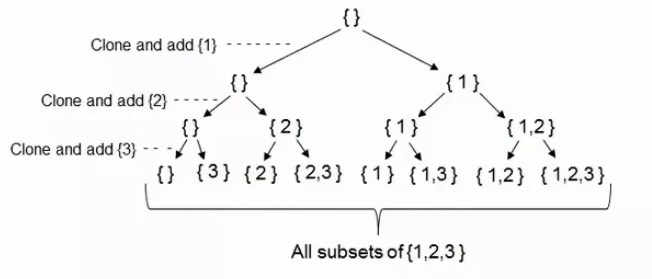
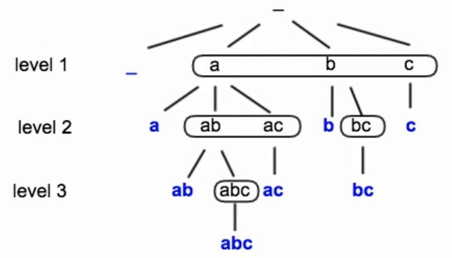
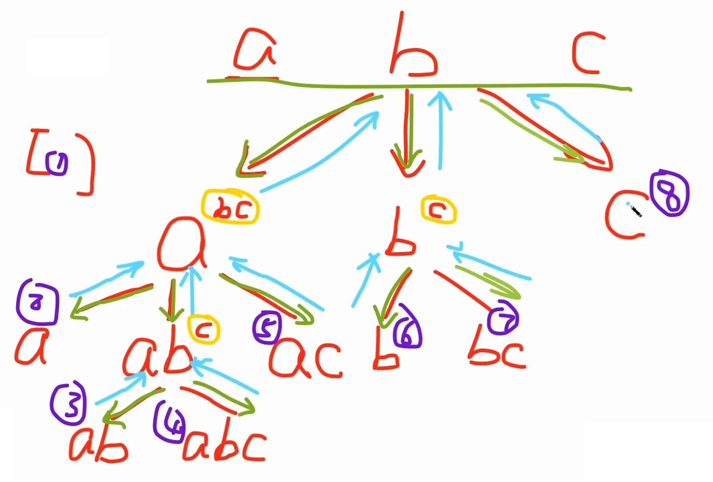
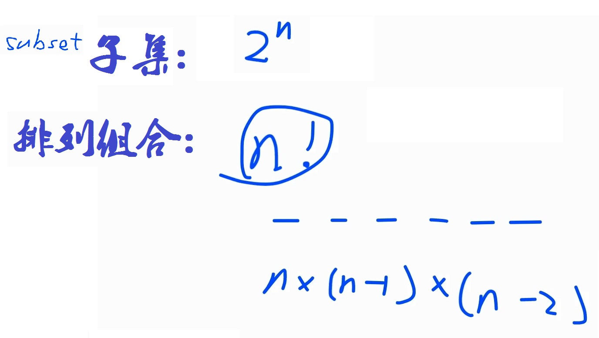
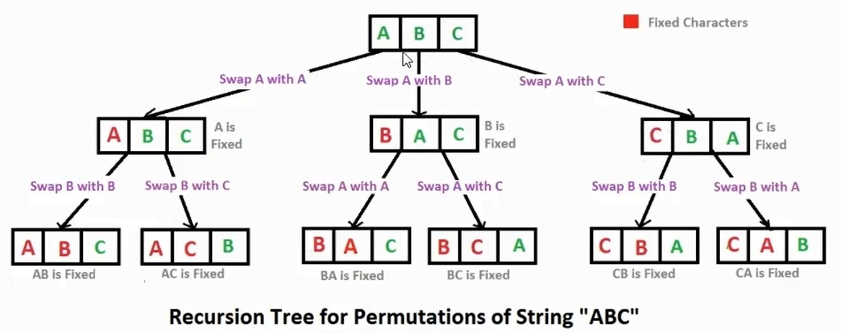
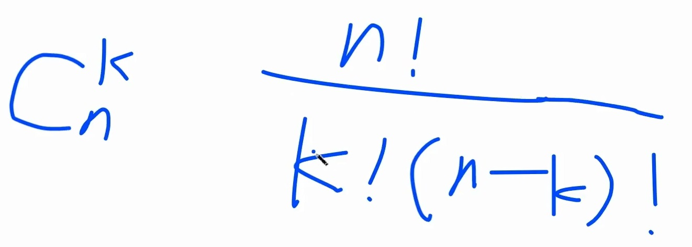
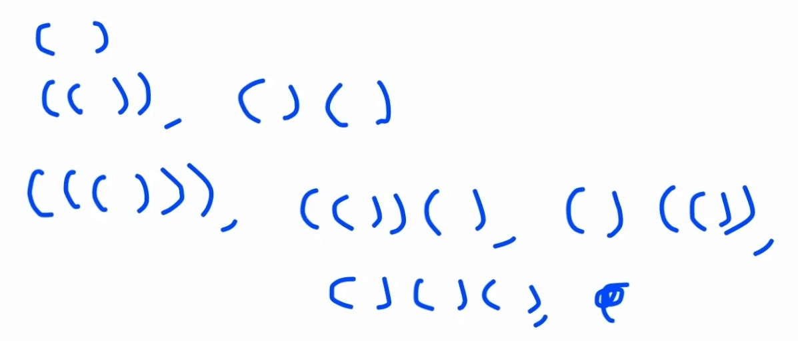
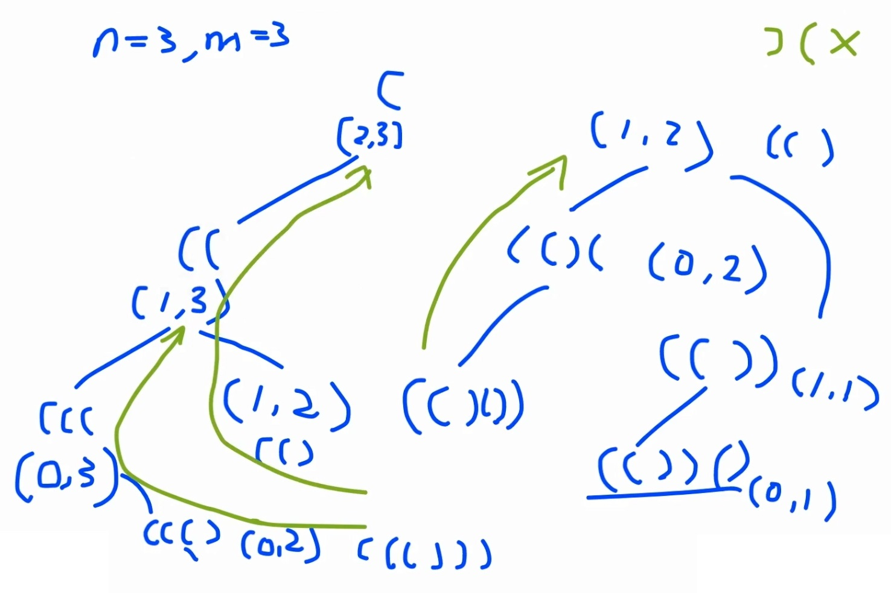

# Recursion II

By the end of this chapter, you should be able to answer these questions. (They are the most interviewed questions in recursion.)

**Backtracking 回溯**

在使用递归解决问题时，我们==将给定的问题分解为更小的问题。==
假设我们有一个问题，我们把它分成三个较小的问题，
然后。现在的情况可能是，问题的解决方案并不取决于所有三个子问题，
事实上，我们甚至不知道它取决于哪一个子问题。
假设你站在三条隧道前，其中一条隧道末端有一袋金子，但你不知道是哪一条。
所以你要三个都试试。

==首先进入隧道，如果不是那个，那么走出隧道，进入隧道，
如果不是那个，再次走出隧道，进入隧道。==

所以基本上在回溯过程中，我们试图解决一个子问题，
如果我们没有达到期望的解决方案，那么撤销我们为解决该子问题所做的一切，
然后尝试解决另一个子问题。

- Subset
- Permutation
- Combination
- N Queens

[toc]

<!-- 
- <a href='#Ex1'>Ex.1 Subset 求子集</a>
- <a href='#Ex2'>Ex.2 Subset II 求子集</a>
- <a href='#Ex3'>Ex.3 Permutation 排列组合</a>
- <a href='#Ex4'>Ex.4 Permutation Unique</a>
- <a href='#Ex5'>Ex.5 Permutation of Size K</a>
- <a href='#Ex6'>Ex.6 Letter Case Permutation</a>
- <a href='#Ex9'>Ex.9 Parentheses 括号</a>
 -->

---


## Ex.1 Subset 求子集

所有可能出现的子集

**题目：**
给你一个不含重复元素的集合 nums，要求返回所有可能的子集。

**解法：**
- **1、迭代解法**
```python
# 解法 1
def subsets(nums):
    result = [[]]
    for item in nums:
        for sub_lis in result[:]:  # 1. 注意这里为什么要用切片 切片其实是复制了一个copy
            result.append(sub_lis+[item])   # 2. 注意每一轮的 item, result 都发生了改变
    return result

# 解法 2
def subsets_2(nums):    # 这种解法可以不使用 : 拷贝元素
    res = [[]]
    for num in nums: 
        res += [ i + [num] for i in res]
    return res
```


```python
# 测试
nums = [1, 2, 3]
print(subsets(nums))
# [[], [1], [2], [1, 2], [3], [1, 3], [2, 3], [1, 2, 3]]
```

<!--  -->

问题 1: 为什么要用 **`result[:]`** ? 
==相当于拷贝了一个副本，无论 result 增删改查都不会影响循环==

```python
l = [1,2]
for e in l:
    #l.append(9)    # 把 9 加上试试，循环永远都不会停
    print(l)
```


```python
l = [1,2,3,4,5]
for i in range(len(l)):
    #print(l[i])
    l.pop()
    print(l)
# [1, 2, 3, 4]
# [1, 2, 3]
# [1, 2]
# [1]
# []
```

问题 2: 为什么用 **`element[:]`** ? 
==拷贝数组中的元素==

```python
# 看一下如果不用 element[:] 拷贝会出来什么结果
def subsets(nums):
    result = [[]]
    for num in nums:
        for element in result[:]:
            #print("before: " , element)
            element.append(num)
            #print("after: " , element)
            result.append(element)
    return result

nums = [1, 2, 3]
ret = subsets(nums)
print("ret: ", ret)
```


<!--  -->
<!--  -->


==以下两道编程题 尽量要理解，不能理解？也要背下来，面试考的概率高==
- **2、递归解法**
```python
def subsets_recursive(nums):
    lis = []
    result = []
    subset_recursive_helper(result, lis, nums, 0)
    return result

def subset_recursive_helper(result, lis, nums, start_idx):
    """
    result   : 结果集
    lis      : 所有可能出现的子集都暂存在 lis 中
    nums     : input 的源集
    start_idx: 控制遍历源集 nums 时的位置索引，避免访问已经访问过的元素
    """
    result.append(lis[:])           # 2. 每一层递归最重要的就是这一步：把新的子集 lis 加入结果集中
    for i in range(start_idx, len(nums)):    # start_idx ~ len(nums)-1 从 start_idx 已经访问过的元素不再重新访问
        sub_lis = lis + [nums[i]]   # 1. sub_lis 构成所有可能出现的子集，在下一层递归中加入到结果集中
        subset_recursive_helper(result, sub_lis, nums, i+1) # 3. 下一层递归所以从当前 i 的下一个索引开始，访问过的索引不再访问
```


```python
# 测试
nums = ['a', 'b', 'c']
print(subsets_recursive(nums))
# [[], ['a'], ['a', 'b'], ['a', 'b', 'c'], ['a', 'c'], ['b'], ['b', 'c'], ['c']]
```

---


## Ex.2 Subset II 求子集

**题目：**
给你一个不含重复元素的集合 nums, 要求返回所有可能的子集。
nums 的集合中可能会包含重复的元素，返回的子集中去掉重复的元素

<!--  -->

**解法：**

- 1、迭代解法
```python
def subsets2(nums):
    res = [[]]
    for num in nums: 
        res += [ i + [num] for i in res if i + [num] not in res]
    return res
```
- 2、递归解法
```py
def subsets_recursive2(nums):
    lis = []
    result = []
    nums.sort()                 # 1. 先排序
    subsets2_recursive_helper(result, lis, nums, 0)
    return result

def subsets2_recursive_helper(result, lis, nums, start_idx):
    result.append(lis[:])
    for i in range(start_idx, len(nums)):
        if (i != start_idx and nums[i] == nums[i-1]):  # 2. 与前面一个数相同时，跳过不要
            continue
        sub_lis = lis + [nums[i]]
        subsets2_recursive_helper(result, sub_lis, nums, i+1)
```


```python
# 测试
nums = [1,2,2]
print(subsets2(nums))
print(subsets_recursive2(nums))
# [[], [1], [2], [1, 2], [2, 2], [1, 2, 2]]
# [1, 2, 2]
# [[], [1], [1, 2], [1, 2, 2], [2], [2, 2]]
```

---

## Ex.3 Permutation 全排列


给你一个字符串，把字符串所有排列组合打印出来

input `abc`
output: `bca cba cab acb bac abc`



**解法：**

- **1、递归解法**
```python
def permute(nums):
    result = []
    sub_lis = []
    permute_helper(result, sub_lis, nums)
    return result

def permute_helper(result, sub_lis, nums):
    if len(nums) == 0:
        result.append(sub_lis)
    for i in range(len(nums)):                  # 1. 索引 i = 上一层下来的 nums
        next_sub_lis = sub_lis + [nums[i]]      # 2. 下一层的 sub_lis = 加上索引元素
        next_nums = nums[0:i] + nums[i+1:]      # 3. 下一层的 nums 剔除索引元素
        permute_helper(result, next_sub_lis, next_nums)
    
nums = [1, 2, 3]
ret = permute(nums)
print(ret)
# [[1, 2, 3], [1, 3, 2], [2, 1, 3], [2, 3, 1], [3, 1, 2], [3, 2, 1]]
```

    



- **2、迭代解法**

the basic idea is, to permute n numbers, we can add the nth number into the resulting list from the n-1 numbers, in every possible position.

For example, if the input num[] is {1,2,3}: First, add 1 into the initial list (let's call it "answer").

Then, 2 can be added in front or after 1. So we have to copy the List in answer (it's just {1}), add 2 in position 0 of {1}, then copy the original {1} again, and add 2 in position 1. Now we have an answer of {{2,1},{1,2}}. There are 2 lists in the current answer.

Then we have to add 3. first copy {2,1} and {1,2}, add 3 in position 0; then copy {2,1} and {1,2}, and add 3 into position 1, then do the same thing for position 3. Finally we have 2*3=6 lists in answer, which is what we want.

其基本思想是，为了排列n个数字，我们可以在每个可能的位置将n-1个数字添加到结果列表中。
例如，如果输入num[]是{1,2,3}：首先，将1添加到初始列表中（我们称之为“应答”）。
然后，可以在1之前或之后添加2。所以我们必须复制答案中的列表（它只是{1}），在{1}的位置0添加2，然后再次复制原始的{1}，并在位置1添加2。现在我们有了
一个{2,1}，{1,2}的答案。当前答案中有两个列表。
然后我们必须加上3。第一次拷贝{2,1}和{1,2}，在0位置加上3；然后复制{2,1}和{1,2}，将3添加到位置1，然后对位置3执行相同的操作。最后我们有2*3=6个列表作为答案，这就是我们想要的。

```python
def permute(nums):
    perms = [[]]   
    for n in nums:
        new_perms = []
        for perm in perms:
            for i in range(len(perm)+1):   
                new_perms.append(perm[:i] + [n] + perm[i:])   ###insert n
        perms = new_perms
    return perms    

nums = [1, 2, 3]
print(permute(nums))
# [[3, 2, 1], [2, 3, 1], [2, 1, 3], [3, 1, 2], [1, 3, 2], [1, 2, 3]]
```
    


```python
import math

def getPermutation(n, k):
    nums = [str(_) for _ in range(1,n+1)]
    k -= 1
    ans = ""
    for i in range(n)[::-1]:
        ans += nums.pop(k // math.factorial(i))
        k %= math.factorial(i)
    return ans

nums = [1, 2, 3]
print(getPermutation(3,5))  # 312
```

    
---

## Ex.4 Permutation Unique

去重


```python
def permUnique(result, nums):
    nums.sort()
    if (len(nums)==0):
        print(result)
    for i in range(len(nums)):
        if (i != 0 and nums[i] == nums[i-1]):
            continue
        permUnique(result+str(nums[i]), nums[0:i]+nums[i+1:])
        
nums = [1, 2, 3]
permUnique('', nums)  
nums = [3, 2, 3]
permUnique('', nums)       

```

    123
    132
    213
    231
    312
    321
    233
    323
    332
    


```python
def permuteUnique(nums):
    ans = [[]]
    for n in nums:
        new_ans = []
        for l in ans:
            for i in range(len(l)+1):
                new_ans.append(l[:i]+[n]+l[i:])
                if i<len(l) and l[i]==n: break              #handles duplication
        ans = new_ans
    return ans


nums = [1, 2, 3]
print(permuteUnique(nums))

nums = [2, 2, 3]
print(permuteUnique(nums))
```

    [[3, 2, 1], [2, 3, 1], [2, 1, 3], [3, 1, 2], [1, 3, 2], [1, 2, 3]]
    [[3, 2, 2], [2, 3, 2], [2, 2, 3]]
    


```python

```

## Ex.5 Permutation of Size K

takes two parameters n and k, and prints out all P(n, k) = n! / (n-k)! permutations that contain exactly k of the n elements.
when k = 2 and n = 4 

(在 n 个数中选 k 个排列组合）

ab ac ad ba bc bd ca cb cd da db dc




```python
def permSizeK(result, nums, k):
    if k == 0:
        print(result)
    for i in range(len(nums)):
        permSizeK(result+str(nums[i]), nums[0:i] + nums[i+1:], k - 1)
```


```python
nums = [1, 2, 3, 4]
k = 2
permSizeK('', nums, k)

```

    12
    13
    14
    21
    23
    24
    31
    32
    34
    41
    42
    43
    

## Ex.6 Letter Case Permutation

Enumerate all uppercase/lowercase permutation for any letter specified in input

For example, 	

word = “medium-one”

Rule = “io”

solutions = [“medium-one”, “medIum-one”, “medium-One”, “medIum-One”]

把 Rule 的字母在 word 中出现的位置用大写和小写的不同排列组合


```python
results = set()
keys = set()

def permLetter(word, rule):
    rule = rule.lower()
    for c in rule:
        keys.add(c)
    permHelper(word, rule, 0, "")
    
def permHelper(word, rule, index, prefix):
    length = len(word)
    
    for i in range(index, length):
        c = word[i]
        if (c in keys):
            permHelper(word, rule, i + 1, prefix + c)
            
            c = c.upper()
            permHelper(word, rule, i + 1, prefix + c)
        else:
            prefix += c
    
    if (len(prefix) == len(word)):
        results.add(prefix)       
```


```python
word = "medium-one"
rule = "nm"

permLetter(word, rule)
print(results)
```

    {'medium-one', 'medium-oNe', 'mediuM-oNe', 'Medium-one', 'Medium-oNe', 'mediuM-one', 'MediuM-one', 'MediuM-oNe'}
    


```python

```

**Ex.7 Combination Sum**

Given a set of candidate numbers (candidates) (without duplicates) and a target number (target), find all unique combinations in candidates where the candidate numbers sums to target.

The same repeated number may be chosen from candidates unlimited number of times.

给一组候选数字和一个目标值 得到人任意个数字之和为目标值 有多少种组合


```python
def comb(nums, t):
    result = []
    tmp = []
    combHelper(result, tmp, nums, t, 0)
    return result
        
def combHelper(result, tmp, nums, remains, start):
    if remains < 0: return
    if remains == 0:
        result.append(tmp[:])
    else:
        for i in range(start, len(nums)):
            tmp.append(nums[i])
            combHelper(result, tmp, nums, remains - nums[i], i)
            tmp.pop()
    
```


```python
candidates = [2,3,6,7]
t = 7
comb(candidates, t)
```


    [[2, 2, 3], [7]]


```python
candidates = [2,3,5]
t = 8
comb(candidates, t)
```


    [[2, 2, 2, 2], [2, 3, 3], [3, 5]]


```python

```

**Ex.8 Combination Sum II**

Given a collection of candidate numbers (candidates) and a target number (target), find all unique combinations in candidates where the candidate numbers sums to target.

Each number in candidates may only be used once in the combination.

Note:

All numbers (including target) will be positive integers.

The solution set must not contain duplicate combinations.


```python
def comb2(nums, t):
    result = []
    tmp = []
    nums.sort()
    combHelper2(result, tmp, nums, t, 0)
    return result
        
def combHelper2(result, tmp, nums, remains, start):
    if remains < 0: return
    if remains == 0:
        result.append(tmp[:])
    else:
        for i in range(start, len(nums)):
            if(i > start and nums[i] == nums[i-1]): continue # skip duplicates
            tmp.append(nums[i])
            combHelper2(result, tmp, nums, remains - nums[i], i + 1)
            tmp.pop()
```


```python
candidates = [10,1,2,7,6,1,5]
t = 8
comb2(candidates, t)
```


    [[1, 1, 6], [1, 2, 5], [1, 7], [2, 6]]


```python
candidates = [2,5,2,1,2]
t = 5
comb2(candidates, t)
```


    [[1, 2, 2], [5]]


```python
candidates = [2,3,6,7]
t = 7
comb2(candidates, t)
```


    [[7]]


```python

```

## Ex.9 Parentheses 括号

Given n pairs of parentheses, write a function to generate all combinations of well-formed parentheses.

n 对括号，有几种组合方式


过程：



```python
def generateParenthesis(n):
    def generate(prefix, left, right, parens=[]):
        if right == 0:   parens.append(prefix)
        if left > 0:     generate(prefix + '(', left-1, right)
        if right > left: generate(prefix + ')', left, right-1)
        return parens
    return generate('', n, n)
```


```python
generateParenthesis(4)
```


    ['(((())))',
     '((()()))',
     '((())())',
     '((()))()',
     '(()(()))',
     '(()()())',
     '(()())()',
     '(())(())',
     '(())()()',
     '()((()))',
     '()(()())',
     '()(())()',
     '()()(())',
     '()()()()']


```python

```

**Ex.10 N Queens**

The n-queens puzzle is the problem of placing n queens on an n×n chessboard such that no two queens attack each other.

Given an integer n, return all distinct solutions to the n-queens puzzle.

Each solution contains a distinct board configuration of the n-queens' placement, where 'Q' and '.' both indicate a queen and an empty space respectively.


```python
def solveNQueens(n):
    res = []
    dfs([-1]*n, 0, [], res)
    return res
 
# nums is a one-dimension array, like [1, 3, 0, 2] means
# first queen is placed in column 1, second queen is placed
# in column 3, etc.
def dfs(nums, index, path, res):
    if index == len(nums):
        res.append(path)
        return  # backtracking
    for i in range(len(nums)):
        nums[index] = i
        if valid(nums, index):  # pruning
            tmp = "." * len(nums)
            dfs(nums, index+1, path + [tmp[:i]+"Q"+tmp[i+1:]], res)
            
# check whether nth queen can be placed in that column
def valid(nums, n):
    for i in range(n):
        if abs(nums[i]-nums[n]) == n - i or nums[i] == nums[n]:
            return False
    return True
```


```python
solveNQueens(4)
```


    [['.Q..', '...Q', 'Q...', '..Q.'], ['..Q.', 'Q...', '...Q', '.Q..']]


```python

```
