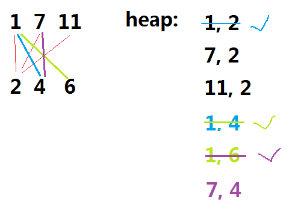
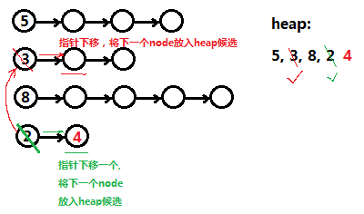
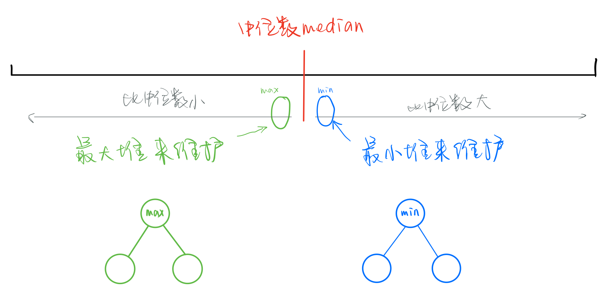

# 目录

[toc]

---


# 特性 

## 自己写一个 Heap

[code line](http://localhost:8888/notebooks/MyJupyterNote/old/16-17_Heap/16_01_heap.ipynb)

```python
class priorityQueueBase:
    """ 堆的基类 """
    class Item:
        __slots__ = '_key', '_value'
        
        def __init__(self, k, v):
            self._key = k
            self._value = v
        
        def __lt__(self, other):
            # 需要可以比较大小的方法
            return self._key < other._key
        
        def is_empty(self):
            return len(self) == 0
        
        def __str__(self):
            return str(self._key)
        

class HeapPriorityQueue(priorityQueueBase):
    ''' 手写最小堆的实现 '''
    
    def __init__(self):
        self._data = []   # 此数据结构容器，item 为 Item class
    
    def __len__(self):
        return len(self._data)
    
    def is_empty(self):
        return len(self) == 0
    
    def add(self, key, value):
        self._data.append(self.Item(key, value))
        cur_idx = len(self._data) - 1
        self._upheap(cur_idx)
    
    def min(self):
        ''' 由此可见 此为最小堆 '''
        if self.is_empty():
            raise ValueError("Empty")
        item = self._data[0]
        return (item._key, item._value)
    
    def remove_min(self):
        ''' 获取最小值，获取完之后剔除 '''
        if self.is_empty():
            raise ValueError("Empty")
        min_idx     = 0
        replace_idx = len(self._data) - 1  # 先挑最末尾的 item 补上堆部位置
        self._swap(min_idx, replace_idx)   # 先直接换上去
        item = self._data.pop()
        self._downheap(min_idx)            # 再一步一步向下比较大小
        return (item._key, item._value)
    
    def _parent(self, i):     # 父节点的 index
        return (i - 1) // 2   # i 为当前节点的 index
    
    def _left(self, i):       # 左边节点的 index
        return 2 * i + 1
    
    def _right(self, i):      # 右边节点的 index
        return 2 * i + 2
    
    def _has_left(self, i):   # 是否存在左边节点
        return self._left(i) < len(self._data)
    
    def _has_right(self, i):  # 是否存在右边节点
        return self._right(i) < len(self._data)
        
    def _upheap(self, i):
        ''' 最小堆 添加元素时，向上比较交换 '''
        parent = self._parent(i)
        if i > 0 and self._data[i] < self._data[parent]:
            self._swap(i, parent)
            self._upheap(parent)   # 递归
    
    def _downheap(self, i):
        ''' 最小堆 删除元素时，向下比较交换 '''
        #  由于左边一定会大于右边，所以左边都没有就不用比了
        if self._has_left(i):
            # 1. 比较得出左右堆中更小的那个
            left_idx = self._left(i)
            small_idx = left_idx
            if self._has_right(i):
                right_idx = self._right(i)
                if self._data[right_idx] < self._data[left_idx]:
                    small_idx = right_idx
            # 2. 将更小的那个与顶端比较
            if self._data[small_idx] < self._data[i]:
                self._swap(i, small_idx)
                self._downheap(small_idx)  # 递归
    
    def _swap(self, i, j):
        ''' 比较大小后，交换节点'''
        self._data[i], self._data[j] = self._data[j], self._data[i]       
```

# 练习


## 0. 计算二维数组的每一列的前 K 大个元素 **TODO**

TODO


## 1. 数组中第 k 个最大的元素

[code line](http://localhost:8888/notebooks/MyJupyterNote/old/16-17_Heap/16_03_heap_PracticeI.ipynb)

**题：**
要求第 k 大的元素


**思路：**
就给一个空数组来放堆，一直 push nums 的遍历数，当大于 k 的时候把顶 pop 出来(顶是最小的)。
最后遍历完了之后把顶 pop 出来（第 k 大）


**解：**
```python
import heapq

def findKthLargest(nums, k):
    heap = []
    for i in nums:
        heapq.heappush(heap, i,)
        if len(heap) > k:
            heapq.heappop(heap)
    return heapq.heappop(heap)

# --------------------------------
# nums = [5,11,3,6,12,9,8,10,14,1,4,2,7,15]
# k = 5
# ret = findKthLargest(nums, k)
# print(ret)
```

---


<!-- ------------------------------------ -->

## 2. 出现频率的前 k 大的元素

[code line](http://localhost:8888/notebooks/MyJupyterNote/old/16-17_Heap/16_03_heap_PracticeI.ipynb)

**题：**
求出给定数组中的元素的出现频率的前 k 大的元素


**思路：**


**解：**
```python
import collections
import heapq
import functools
import heapq
import functools

@functools.total_ordering
class Element:
    def __init__(self, count, word):
        self.count = count
        self.word = word
    
    def __lt__(self, other):
        if self.count == other.count:
            return self.word < other.word
        return self.count < other.count

    def __eq__(self, other):
        return self.count==other.count and self.word==other.word


def topKFrequent(words, k):
    counts = collections.Counter(words)     # 统计每个 word 出现的个数
    # print(counts)
    freqs = []
    heapq.heapify(freqs)
    for word, count in counts.items():
        item = (Element(count, word), word) # 如果没有指定，默认是用元祖的第一个元素来判断大小
        heapq.heappush(freqs, item)
        if len(freqs) > k:
            heapq.heappop(freqs)

    res = []
    for _ in range(k):
        word = heapq.heappop(freqs)[1]
        res.append(word)
    return res[::-1]

# ---------------------------------------------------------
# words = ["i", "love", "you", "i", "love", "coding","i","like","sports","i","love","travel","coding","is","fun"]
# k = 4
# ret = topKFrequent(words, k)
# print(ret)

```

---


<!-- ------------------------------------ -->

## 3. Ugly Number

[code line](http://localhost:8888/notebooks/MyJupyterNote/old/16-17_Heap/16_03_heap_PracticeI.ipynb)

**题：**
判断一个数是否为 Ugly Number
（Ugly Number :只能由 2,3,5 相乘所得的正整数）
**思路：**


丑数一定是有限个 2、3、5 的乘积，
因为所有的正整数都能分解成1与一个或多个素数的乘积。
==如果一个数是丑数，那么反复除以2、3、5后，一定会是1；
如果一个数不是丑数，那么反复除以2、3、5后，一定还会剩下了一个质数无法被2、3、5整除。==

**解：**
```python
def uglyNumber(num):
    if num <= 0:
        return False
    
    while num % 2 == 0:
        num = num / 2
    while num % 3 == 0:
        num = num /3
    while num % 5 == 0:
        num = num / 5
     
    return num == 1

# ------------------------------------------------
# ret = [x for x in range(15) if uglyNumber(x)]
# print(ret)
```

---


<!-- ------------------------------------ -->

## 4. Ugly Number II （==动态候选池==问题）（TODO

[code line](http://localhost:8888/notebooks/MyJupyterNote/old/16-17_Heap/16_03_heap_PracticeI.ipynb)

**题：**
给定一个 n, 求出最小的 n 个  Ugly Number


**思路：**
1、给定一个序列 list，放符合的候选 UglyNumber。先给一个基本的 Ugly Number : 2, 3, 5 放入 list
2、取出序列 list 中最前面的数
3、在取出数的同时，将 当前取出的数 i*2, i*3, i*5 得到的数依次放入 list
4、重复步骤 2,3

==**TODO :**==
在 pad 上画思路图，力求清晰明了

**解：**
```python
import heapq

# 正解
def nthUglyNumber(n):
    p1, p2, p3 = [2], [3], [5]
    ugly = 1        # 注意 1 也是 ugly number

    # 要遍历 3 个动态列表合并的堆
    for num in heapq.merge(p1, p2, p3): # heapq.merge : 融合排序序列,将返回多个序列融合之后排好序的列表
        print("num: {}".format(num))
        if n == 1:
            return ugly     # ugly: 上一轮循环的 num
        if num > ugly:      # 注意有可能会出现重复的数字
            ugly = num
            p1.append(num * 2)
            p2.append(num * 3)
            p3.append(num * 5)
            n -= 1

# -------------------------------------------------------
# n = 10
# ret = nthUglyNumber(n)
# print(ret)
```

---


<!-- ------------------------------------ -->

## 5. 求加和值最小的 k 对 pair（Find K Pairs with Smallest Sums

[code line](http://localhost:8888/notebooks/MyJupyterNote/old/16-17_Heap/16_03_heap_PracticeI.ipynb)

**题：**
给出两个排好序的 list。
限制每对 pair 需要从 list1,list 分别取一个数，
求加和值最小的 k 对 pair
```
例如：
list1 = [1,7,11]  list2 = [2,4,6]  k=3 
return: [1,2] [1,4] [1,6]

list1 = [1,1,2]  list2 = [1,2,3]  k=2 
return: [1,1] [1,1]
```
==这不是动态候选池的解法，这是一道非常简单的堆的 pop 最小值的问题，只是进行了变形而已==


**思路：**

例如：`list1 = [1,7,11]  list2 = [2,4,6]  k=3`
1、定义一个 heap 放候选的 pair。先将基本的 pair : [1,2] [7,2] [11,2] 放入 heap
2、在 heap 中新增候选 pair [1,4]
3、在此时 heap 的所有候选 pair 中找到最小的加值 pair : [1,2]
4、重复步骤 2，3

</img>

TODO：感觉思路没缕清晰，有空画个更容易懂的

**解：**
```python
# 时间复杂度：k*lg(k)
import heapq

def kSmallestPairs(num1, num2, k):
    heap = []
    def push(idx1, idx2):
        if idx1 < len(num1) and idx2 < len(num2):
            item = (num1[idx1] + num2[idx2], idx1, idx2)    # 注意元祖item 以第一个元素比较大小(这里用加和值比较大小)
            heapq.heappush(heap, item)
    push(0, 0)
    pair = []
    while heap and len(pair) < k:
        _, i, j = heapq.heappop(heap)
        pair.append((num1[i], num2[j]))
        push(i, j+1)
        if j == 0:
            push(i+1, j)
    return pair


# -----------------------------------------
num1 = [1,7,11]
num2 = [2,4,6]
k = 20
ret = kSmallestPairs(num1, num2, k)
print(ret)
```

---


<!-- ------------------------------------ -->

# 练习 2

## 1. 合并 k 个有序序列 Merge K Sorted List **TODO**

[code line](http://localhost:8888/notebooks/MyJupyterNote/old/16-17_Heap/16_01_heap.ipynb)

**题：**
给你 k 个有序链表，将它们都合并在一个有序链表中


**思路：**
</img>

TODO: 上面的思路图不太对，有空再画一个

TODO: 整理思路


**解：**
```python
from queue import PriorityQueue
from clas.LinkedList import LinkedList
from clas.LinkedList import Node

def mergeKLists(lists):
    dummy = Node()  # 哨兵结点: 记录合并以后的链表的头，完成之后直接返回
    cur = dummy
    q = PriorityQueue()
    # 先把每个链表的第一个结点先放进去
    for node in lists:
        if node is not None:
            q.put((node.value, node))
    while q.qsize() > 0:
        min_node = q.get()[1]
        cur.next = min_node
        cur = cur.next
        if cur.next:
            q.put((cur.next.value, cur.next))
    return dummy.next       # 注意：返回的时候不能返回哨兵节点，而是哨兵的next 头结点

# ------------------------------------------
lst1 = LinkedList()
lst1.add_last(1)
lst1.add_last(4)
lst1.add_last(5)

lst2 = LinkedList()
lst2.add_last(1)
lst2.add_last(3)
lst2.add_last(4)

lst3 = LinkedList()
lst3.add_last(2)
lst3.add_last(6)

# -------------------------
lists = [
    lst1.head.next, 
    lst2.head.next, 
    lst3.head.next
]
node = mergeKLists(lists)   # <----
result = LinkedList()

result.head.next = node
result.printlist()
```

[leetcode](https://leetcode-cn.com/problems/merge-k-sorted-lists/) : 
注意一下在 leetcode 上面给出的 **ListNode** 类型怎么使用

```python
# Definition for singly-linked list.
# class ListNode(object):
#     def __init__(self, x):
#         self.val = x
#         self.next = None

class Solution(object):
    def mergeKLists(self, lists):
        """
        :type lists: List[ListNode]
        :rtype: ListNode 链表
        """
        import heapq
        h = []
        dummy = ListNode(0)  # 注意获取哨兵节点的方式
        cur = dummy
        for head in lists:
            if head:
                heapq.heappush(h, (head.val, head))
        while h:
            _, min_node = heapq.heappop(h)
            cur.next = min_node
            cur = cur.next
            if cur.next:
                heapq.heappush(h, (cur.next.val, cur.next))
        return dummy.next
```


---


<!-- ------------------------------------ -->

## 2.从数据流中获取中位数 Find Median From Data Stream **TODO**

[code line](http://localhost:8888/notebooks/MyJupyterNote/old/16-17_Heap/16_01_heap.ipynb)

**题：**
从一个数据流中获取中位数
（数据流：不知道什么时候，才会停止增加的数据，不知道数据长度）

要求：
设计一个支持以下两种操作的数据结构：
`void addNum(int num)` - 从数据流中添加一个整数到数据结构中。
`double findMedian()` - 返回目前所有元素的中位数。


**思路：**
</img>

注意几点：
- 1、**将最大堆和最小堆的长度差保持在 1 之内**，就可将最大堆与最小堆的整体数据按照中位数划分
- 2、**让最大堆的长度总是大于最小堆**。这样
    - 当数据总长度为奇数时，`中位数 = 最大堆堆顶`
    - 当数据总长度为偶数时，`中位数 = (最小堆堆顶+最大堆堆顶) / 2`
    


**解：**

```python

```


[leetcode](https://leetcode-cn.com/problems/shu-ju-liu-zhong-de-zhong-wei-shu-lcof/)


---


<!-- ------------------------------------ -->
<!-- 
## 3. 管理你的项目 Manage Your Project (IPO)

[code line](http://localhost:8888/notebooks/MyJupyterNote/old/16-17_Heap/16_01_heap.ipynb)


**题：**


**思路：**


**解：**
```python

```

---
 -->


