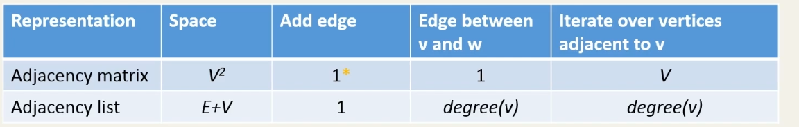

# 目录

[toc]

---

# 图论

## 图特性

特性如下：

**无向图**：图中的线是没有方向的，可以从 a 顶点走到 b 顶点
**路径 path**: 走过的顶点集合
**入度 indegree** : 有多少方向进入当前顶点
**出度 outdegree** : 有多少方向从当前顶点出去


## 常见问题

- 城市问题
- 相连问题
- 3-coloring 问题，图颜色问题
- 机票问题，怎么样买机票，最实惠
- 城市路径

  

# 1. 图形 ADT, 实现一个图 

</img>


## 1.1 领接矩阵图表示法
<sup style="color:#ccc">18-03 00:08:52~</sup>


代码实现一个图：<sup style="color:#ccc">18-04 00:10:52~</sup>
```py
class Vertex:       # 顶点类
    def __init__(self, node):
        self.id = node              # id
        # Mark all nodes unvisited        
        self.visited = False  

    def addNeighbor(self, neighbor, G):
        G.addEdge(self.id, neighbor)

    def getConnections(self, G):
        return G.adjMatrix[self.id]

    def getVertexID(self):
        return self.id

    def setVertexID(self, id):
        self.id = id

    def setVisited(self):
        self.visited = True

    def __str__(self):
        return str(self.id)

class Graph:        # 图
    def __init__(self, numVertices=10, directed=False):
        self.adjMatrix = [[None] * numVertices for _ in range(numVertices)] # 一开始创建 10*10 的二维矩阵
        self.numVertices = numVertices
        self.vertices = []   # list ==> dict {id:vertex}
        self.directed = directed
        for i in range(0, numVertices):         # 矩阵中的每个 item 为 顶点类
            newVertex = Vertex(i)
            self.vertices.append(newVertex)

    def addVertex(self, vtx, id):
        if 0 <= vtx < self.numVertices:
            self.vertices[vtx].setVertexID(id)

    def getVertex(self, n):
        for vertxin in range(0, self.numVertices):
            if n == self.vertices[vertxin].getVertexID():
                return vertxin
        return None

    def addEdge(self, frm, to, cost=0): 
        #print("from",frm, self.getVertex(frm))
        #print("to",to, self.getVertex(to))
        if self.getVertex(frm) is not None and self.getVertex(to) is not None:
            self.adjMatrix[self.getVertex(frm)][self.getVertex(to)] = cost
            if not self.directed:
                # For directed graph do not add this
                self.adjMatrix[self.getVertex(to)][self.getVertex(frm)] = cost  

    def getVertices(self):
        # *** create a copy, and return a copy ***
        vertices = []
        for vertxin in range(0, self.numVertices):
            vertices.append(self.vertices[vertxin].getVertexID())
        return vertices
        '''
        注意：这里不能直接把 self.vertices 返回回去！！
        如果外部人员直接调用 
        v = grapg.getVertices()
        v.append('xxx')
        del v
        将直接损害内部成员，造成整个类逻辑不自洽
        '''

    
    def printMatrix(self):
        for u in range(0, self.numVertices):
            row = []
            for v in range(0, self.numVertices):
                row.append(str(self.adjMatrix[u][v]) if self.adjMatrix[u][v] is not None else '/')
            print(row)

    def getEdges(self):
        edges = []
        for v in range(0, self.numVertices):
            for u in range(0, self.numVertices):
                if self.adjMatrix[u][v] is not None:
                    vid = self.vertices[v].getVertexID()
                    wid = self.vertices[u].getVertexID()
                    edges.append((vid, wid, self.adjMatrix[u][v]))
        return edges
    
    def getNeighbors(self, n):
        neighbors = []
        for vertxin in range(0, self.numVertices):
            if n == self.vertices[vertxin].getVertexID():
                for neighbor in range(0, self.numVertices):
                    if (self.adjMatrix[vertxin][neighbor] is not None):
                        neighbors.append(self.vertices[neighbor].getVertexID())
        return neighbors
    
    def isConnected(self, u, v):
        uidx = self.getVertex(u) 
        vidx = self.getVertex(v)
        return self.adjMatrix[uidx][vidx] is not None
    
    def get2Hops(self, u):
        neighbors = self.getNeighbors(u)
        print(neighbors)
        hopset = set()
        for v in neighbors:
            hops = self.getNeighbors(v)
            hopset |= set(hops)
        return list(hopset)
```     
测试：
```py
graph = Graph(6,True)
graph.addVertex(0, 'a')
graph.addVertex(1, 'b')
graph.addVertex(2, 'c')
graph.addVertex(3, 'd')
graph.addVertex(4, 'e')
graph.addVertex(5, 'f')
graph.addVertex(6, 'g') # doing nothing here 
graph.addVertex(7, 'h') # doing nothing here

print(graph.getVertices())
graph.addEdge('a', 'b', 1)  
graph.addEdge('a', 'c', 2)
graph.addEdge('b', 'd', 3)
graph.addEdge('b', 'e', 4)
graph.addEdge('c', 'd', 5)
graph.addEdge('c', 'e', 6)
graph.addEdge('d', 'e', 7)
graph.addEdge('e', 'a', 8)
print(graph.printMatrix())
print(graph.getEdges())    
```


## 1.2 邻接列表图表示
<sup style="color:#ccc">18-06 00:03:52~</sup>


```py
import sys
class Vertex:
    def __init__(self, node):
        self.id = node
        self.adjacent = {}
        # Set distance to infinity for all nodes
        self.distance = sys.maxsize
        # Mark all nodes unvisited        
        self.visited = False  
        # Predecessor
        self.previous = None

    def addNeighbor(self, neighbor, weight=0):
        self.adjacent[neighbor] = weight

    # returns a list 
    def getConnections(self): # neighbor keys
        return self.adjacent.keys()  

    def getVertexID(self):
        return self.id

    def getWeight(self, neighbor):
        return self.adjacent[neighbor]

    def setDistance(self, dist):
        self.distance = dist

    def getDistance(self):
        return self.distance

    def setPrevious(self, prev):
        self.previous = prev

    def setVisited(self):
        self.visited = True

    def __str__(self):
        return str(self.id) + ' adjacent: ' + str([x.id for x in self.adjacent])
    
    def __lt__(self, other):
        return self.distance < other.distance and self.id < other.id    

class Graph:
    def __init__(self, directed=False):
        # key is string, vertex id
        # value is Vertex
        self.vertDictionary = {}
        self.numVertices = 0
        self.directed = directed
        
    def __iter__(self):
        return iter(self.vertDictionary.values())

    def isDirected(self):
        return self.directed
    
    def vectexCount(self):
        return self.numVertices

    def addVertex(self, node):
        self.numVertices = self.numVertices + 1
        newVertex = Vertex(node)
        self.vertDictionary[node] = newVertex
        return newVertex

    def getVertex(self, n):
        if n in self.vertDictionary:
            return self.vertDictionary[n]
        else:
            return None

    def addEdge(self, frm, to, cost=0):
        if frm not in self.vertDictionary:
            self.addVertex(frm)
        if to not in self.vertDictionary:
            self.addVertex(to)

        self.vertDictionary[frm].addNeighbor(self.vertDictionary[to], cost)
        if not self.directed:
            # For directed graph do not add this
            self.vertDictionary[to].addNeighbor(self.vertDictionary[frm], cost)

    def getVertices(self):
        return self.vertDictionary.keys()

    def setPrevious(self, current):
        self.previous = current

    def getPrevious(self, current):
        return self.previous

    def getEdges(self):
        edges = []
        for key, currentVert in self.vertDictionary.items():
            for nbr in currentVert.getConnections():
                currentVertID = currentVert.getVertexID()
                nbrID = nbr.getVertexID()
                edges.append((currentVertID, nbrID, currentVert.getWeight(nbr))) # tuple
        return edges
    
    def getNeighbors(self, v):
        vertex = self.vertDictionary[v]
        return vertex.getConnections()
```

## 1.3 两种实现的性能

<sup style="color:#ccc">18-07 00:02:14~</sup>


在实践中，使用比较多的是邻接列表表示
在现实生活中的图通常都比较稀疏

不支持平行边


---

# 2.  **DFS** (**D**epth-**F**irst-**S**earch) 深度优先搜索
<sup style="color:#ccc">18-08 00:09:30~</sup>
回溯思想，一条道走到黑，走不下去再回头

<sup style="color:#ccc">18-09 00:09:30~</sup>
</img>


<!-- 
</img>
<sup style="color:#ccc">18-10   00:03:52~</sup>
 -->


<br><br><br><br><br><br><br><br>
<br><br><br><br><br><br><br><br>


