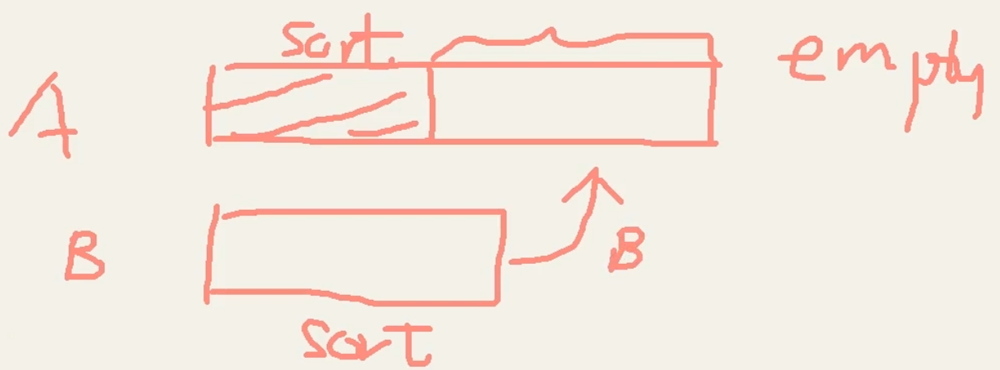
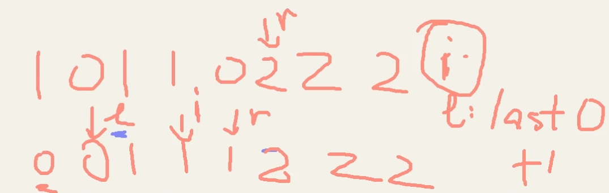
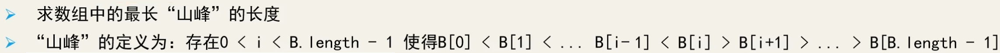
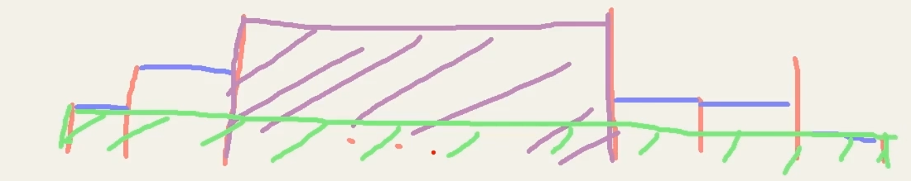
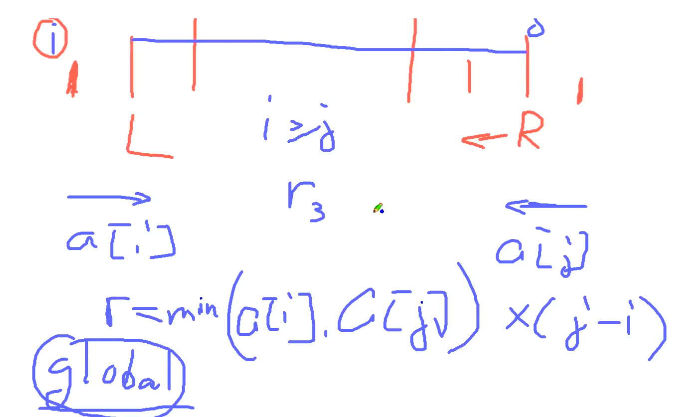

# 目录

[toc]

---


# 特性 


---


# 练习


## 0. 反转列表 Reverse List

**题：**<sup style="color:#ccc">22-02 00:01:11~</sup>
给你一个字符串或者列表，把它们反转过来

**思路：**
头尾两两对调

**解法 1：**
```python
def reverse(nums):
    n = len(nums)
    for i in range(len(nums) // 2):
        nums[i], nums[n-1-i] = nums[n-1-i], nums[i]
    return nums

# ------
# 测试
nums = []
print(reverse(nums))
nums = [1]
print(reverse(nums))
nums = [1, 2]
print(reverse(nums))
```
**解法 2：** 双指针
```py
def reverse2(nums):
    i, j = 0, len(nums)-1
    while i < j:
        nums[i], nums[j] = nums[i], nums[i]
        i += 1
        j -= 1
    return nums

# ------
# 测试
nums = []
print(reverse2(nums))
nums = [1]
print(reverse2(nums))
nums = [1, 2]
print(reverse2(nums))
```

---


## 1. 两数求和

**题：**
在一个有 **`n`** 个整数的数组 **`S`** 中，要求找出两个数 **`(a,b)`** 相加等于 **`X`** 的组合。


**思路：**


**解 1：** <sup style="color:#ccc">22-03 00:06:37~00:07:03</sup>

```python

```
 **解 2：** <sup style="color:#ccc">22-03 00:07:05~00:07:35 sup>

```python

```


---


---


## 2. 三数求和

**题：**
给你一个字符串或者列表，把它们反转过来


**思路：**


**code：** <sup style="color:#ccc">22-03 00:07:35~00:08:05 sup>

```python

```


---


## 3. 四数求和

**题：**
给你一个字符串或者列表，把它们反转过来


**思路 1：**


**code 1：** <sup style="color:#ccc">22-03 00:08:05~00:08:33</sup>

```python

```

<br>
<br>

**思路 2：**

**code 2：** (重点) <sup style="color:#ccc">22-03 00:08:33~00:11:18</sup>

```python

```


### 如何处理重复

<sup style="color:#ccc">22-03 00:11:18~00:13:32</sup>

小技巧
1. 使用 Set
2. 先排序 遇到相同的数则跳过

---


## 扩展： K  个数求和

**思路：** <sup style="color:#ccc">22-04 00:00:08~00:03:51</sup>

使用回溯的方法：求 k 个数的子集，子集中有和为 target 的则为结果集中的一个子集

时间复杂度：O(2<sup>n</sup>)


---

## 4. 合并两个有序数组

**题：**
将数组 B 容纳进数组 A 并排序，
其中数组 A 数组 B 都为有序数组，且数组 A 中有足够空间来容纳 B
返回容纳 B 以后的 A 数组
</img>


**思路：** <sup style="color:#ccc">22-04 00:09:00~00:14:24</sup>
两个指针从后往前，用后面 A 空出来的位置一个一个双指针排序

**注意点**：
什么时候停止 i>=0, j>=0,如果 A 数组先用完了，要把 B 数组全部 copy 到 A 数组前面去；若 B 数组用完了，那就是排完了
<br>

==双指针 **变通**：
指针可以 **从前往后、从后往前、一前一后** ，注意灵活==

<br>
<br>

**code：**<sup style="color:#ccc">22-04 00:14:24~00:15:55</sup>

```python

```

---


---

## 5. 两有序数组的最小元素差

**题：**
给你两个有序数组，在两个数组中分别找一个数，使得这两个数的差是最小的


**思路：** <sup style="color:#ccc">22-05 00:04:14~00:09:33</sup>
两个数组索引分别为 i, j，用索引遍历数组 A, B, 当 A[i]与B[j] 比较时，移动小的那个值的索引到下一个位置


**code：** <sup style="color:#ccc">22-05 00:10:12~</sup>

```python

```


<br>
<br>

---


## 6. 两有序数组的交集

**题：**
给你两个有序数组，求两数组的交集


**思路：** <sup style="color:#ccc">22-05 00:10:32~00:12:27</sup>
两种：


**code：**
```python

```

---


## 6. 连续子数组的最大值

**题：**
给你一个有 n 个正整数的数组。一个 m
找到一个连续的子数组，使得连续子数组之和尽可能大，但不能大于 m


**思路：** <sup style="color:#ccc">22-06 00:02:43~00:11:28</sup>
这题其实是一道非常简单的 ==**滑动窗口**==


**code：** <sup style="color:#ccc">22-06 00:11:28~00:15:15</sup>
```python
# 时间复杂度 O(n) 不管是 i 还是 j 最多从头到尾走一遍
```

---


## 7. 寻找主元素 | Majority Element

<sup style="color:#999">其实这道题并没有用双指针法，不过教程中把它放在了这里</sup>

**题：**
给你一个长度为 n 的数组，
其中有一个元素出现的次数超过了数组长度的一半，找出这个元素


**思路：** <sup style="color:#ccc">22-07 00:02:01~00:11:28</sup>
maintain 一个 count，一个 candidate 候选。
由于那个元素出现次数超过数组长度一半，所以最后剩下的一定是那个元素
两两遍历，当两个不相同就舍弃，相同 count 就加 1，放入 candidate

==**同归于尽法**==（业界称为`摩尔投票算法 Boyer-Moore Voting Algorithm`）
（反正好人是比坏人多的，那就好坏一起舍弃，==最后剩下的一定是好人==）


**code：** <sup style="color:#ccc">22-07 00:11:28~00:13:24 EX.1</sup>
[link](http://localhost:8888/notebooks/MyJupyterNote/old/22_____TwoPointer/21_02_TwoPointersII.ipynb)
```python

```

---


## 8. 寻找主元素 2 | Majority Element II

**题：**
给你一个长度为 n 的数组，
其中有一个元素出现的次数超过了数组长度的 1/3，找出这个元素


**思路：** <sup style="color:#ccc">12-08 00:00:42~00:04:26</sup>
也是用摩尔投票算法，不过这里用两个 count, 两个 candidate


**code：** <sup style="color:#ccc">12-08 00:04:26~00:05:40 Ex.2</sup>
[link](http://localhost:8888/notebooks/MyJupyterNote/old/22_____TwoPointer/21_02_TwoPointersII.ipynb)
```python

```

---


## 9. 颜色排序（荷兰国旗） | Sort Color

**题：**
给你一个包含 红、白、蓝 三种颜色，长度为 n 的数组。
要求你将数组元素进行分类使相同的颜色相邻，并按照红、白、蓝的顺序排序
（可以使用 0、1、2 分别代表三种颜色）


**思路：** <sup style="color:#ccc">12-09 00:00:58~00:09:32</sup>
法1： count sort 计数排序

法2：
</img>


**code：** <sup style="color:#ccc">12-09 00:09:32~00:12:00 Ex.3</sup>
[link](http://localhost:8888/notebooks/MyJupyterNote/old/22_____TwoPointer/21_02_TwoPointersII.ipynb)
```python

```

---


## 10. 寻找 K 个最近的元素 | Find K Closest Elements

**题：** <sup style="color:#ccc">22-10 00:00:38~00:10:21</sup>
给你一个有序数组，两个整数变量 k 和 x。
请找到数组中离 x 最近的 k 个元素，并且返回的 k 个元素需按升序排列。
如果两个数字距离 x 相等，要求求取较小的那个。


**思路：** <sup style="color:#ccc">22-10 00:10:21~00:05:18 </sup>
找到离 x 最近的那个数，然后 i, j 指针向两边移动


**code：** <sup style="color:#ccc">22-10 00:05:18~00:06:58 Ex.4</sup>
[link](http://localhost:8888/notebooks/MyJupyterNote/old/22_____TwoPointer/21_02_TwoPointersII.ipynb)
```python

```

---


## 11. 寻找喜马拉雅山 | Longest Mountain in Array

**题：**

</img>


**思路：** <sup style="color:#ccc"></sup>


**code：** <sup style="color:#ccc"> Ex.</sup>
[link](http://localhost:8888/notebooks/MyJupyterNote/old/22_____TwoPointer/21_02_TwoPointersII.ipynb)
```python

```

---


## 12. 容纳最多的水 | Container With Most Water

leetcode.11 
中等难度 分类 [双指针][动态规划]

**题：** <sup style="color:#ccc">22-11 00:00:35~00:02:56</sup>
给定 n 个非负整数 **`a1, a2 ,.., an`**, 其中每个代表一个点坐标 **`(i, ai)`** ,
并且有 n 条垂直线段，每条线段的两个端点在 **`(i,ai), (i,0)`** 上，
请找出两条垂直线段，与 x 轴形成一个容器，使其包含最多的水。n


</img>


**思路：** <sup style="color:#ccc">22-11 00:03:16~00:11:21</sup>
法①：brute force 暴力解
两两选择组成 pair，先组成所有棍子的组合
```python
def max_area(heights):
    res = 0
    for i in range(len(heights)):
        for j in range(i+1, len(heights)):
            res = max(res, min(heights[i], heights[j]) * (j - i))
    return res

heights = [1, 5, 4, 3]
heights = [3, 1, 2, 4, 5]
print(max_area(heights))
```

法②：双指针
1、i, j 由两边向中间推进
2、每次都移动小的那个元素的索引，因为移动大的容积显然会变小
</img>

**code：** <sup style="color:#ccc">22-11 00:11:21~00:12:02 Ex.6</sup>
[link](http://localhost:8888/notebooks/MyJupyterNote/old/22_____TwoPointer/21_02_TwoPointersII.ipynb)
```python
def max_area(heights):
    left, right = 0, len(heights)-1
    maxres = 0
    while left < right:
        height = min(heights[left], heights[right]) # 高度取决于短的棍子
        area = height * (right-left)
        maxres = max(maxres, area)
        if heights[left] < heights[right]:
            left += 1
        else:
            right -= 1
    return maxres

heights = [1, 5, 4, 3]
heights = [3, 1, 2, 4, 5]
print(max_area(heights))
```

---

## 总结 

<sup style="color:#ccc">22-12</sup>

双指针的题型基本上都是跟数组一个出来

① 一个数组：
先问自己，要不要排序

然后双指针走向：
- 两个都从前往后
- 两个都从后往前
- 一前一后
- 从中间往两边
- 从两边往中间


② 两个数组
基本上是有序数组，然后用双指针，走向同上


