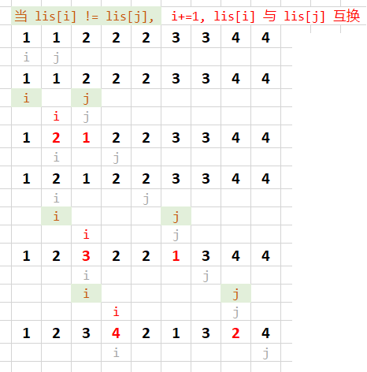
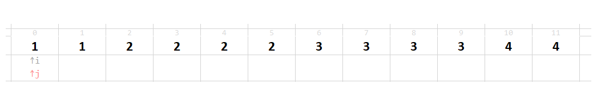

# 目录

[toc]

---

# 练习


## 1. 删除重复元素 | Remove Duplicates from Sorted Array
**题：** <sup style="color:#ccc">23-01 00:05:38~00:08:26</sup>

给定一个 **==排序==** 数组，<u>删除重复出现的元素</u>（只保留此元素的一个），
这样新的数组中每个元素只出现一次，并<u>返回这个新数组的长度</u>


**思路：** <sup style="color:#ccc">23-01 00:08:28~00:14:58</sup>

==这题实际上是双指针==

</img>
自己画过程中的变化，这题很简单，
到最后 i 指针前面的都是不重复的，所以可以直接返回 i+1 为数组长度

**code：** <sup style="color:#ccc">23-02 00:00:08~00:01:34 Ex.1</sup>
[link](http://localhost:8888/notebooks/MyJupyterNote/old/23_____SlideWindows/22_01_.ipynb)
```python
def removeDuplicates(lis):
    if not lis:
        return 0
    
    i = 0
    for j in range(1, len(lis)):
        if lis[j] != lis[i]:
            i += 1
            lis[i] = lis[j]
    return i+1
```


---


## 2. 删除重复元素 2
**题：** <sup style="color:#ccc">23-02 00:02:07~00:03:01</sup>
上一题的基础上，允许最后返回的数组中重复数最多出现两次


**思路：** <sup style="color:#ccc">23-02 00:03:01~00:06:15</sup>
==**记住： 
`i`指向的位置是下一个要置换正确数的位置。
`i`前面的位置表示已经置换好了的子数组**==
</img>

（如果动图思路跟不上可以自己去文件夹里面一张一张翻源图片）

**code：** <sup style="color:#ccc">23-02 00:06:15~00:07:16 Ex.2</sup>
[link](http://localhost:8888/notebooks/MyJupyterNote/old/23_____SlideWindows/22_01_.ipynb)
```python
def removeDuplicates2(nums):
    if not nums:
        return 0
    
    i = 0
    for j in range(len(nums)):
        if nums[i-2] != nums[j] or (i < 2):
            nums[i] = nums[j]
            i += 1
    return i
```


---


## 3. 删除元素 Remove Element
**题：** <sup style="color:#ccc">23-03 00:00:09~00:00:53</sup>

给定一个数组 **`nums`** 和一个值 **`val`**，
就地(**==in-place==**)删除这个 val 的所有实例，并返回新的数组的长度。
(注意没讲数组有没有排序)


**思路：** <sup style="color:#ccc">23-03 00:00:57~00:02:33</sup>


**code：** <sup style="color:#ccc">23-03 00:02:35~ Ex.</sup>
[link]()
```python
def removeElement(nums, val):
    i = 0
    for j in range(len(nums)):
        if nums[j] != val:
            nums[i] = nums[j]
            i += 1
    return i
```


---


## . 
**题：** <sup style="color:#ccc"></sup>


**思路：** <sup style="color:#ccc"></sup>


**code：** <sup style="color:#ccc"> Ex.</sup>
[link]()
```python

```


---


## . 
**题：** <sup style="color:#ccc"></sup>


**思路：** <sup style="color:#ccc"></sup>


**code：** <sup style="color:#ccc"> Ex.</sup>
[link]()
```python

```


---


## . 
**题：** <sup style="color:#ccc"></sup>


**思路：** <sup style="color:#ccc"></sup>


**code：** <sup style="color:#ccc"> Ex.</sup>
[link]()
```python

```


---


## . 
**题：** <sup style="color:#ccc"></sup>


**思路：** <sup style="color:#ccc"></sup>


**code：** <sup style="color:#ccc"> Ex.</sup>
[link]()
```python

```


---


## . 
**题：** <sup style="color:#ccc"></sup>


**思路：** <sup style="color:#ccc"></sup>


**code：** <sup style="color:#ccc"> Ex.</sup>
[link]()
```python

```


---


## . 
**题：** <sup style="color:#ccc"></sup>


**思路：** <sup style="color:#ccc"></sup>


**code：** <sup style="color:#ccc"> Ex.</sup>
[link]()
```python

```


---


## . 
**题：** <sup style="color:#ccc"></sup>


**思路：** <sup style="color:#ccc"></sup>


**code：** <sup style="color:#ccc"> Ex.</sup>
[link]()
```python

```


---