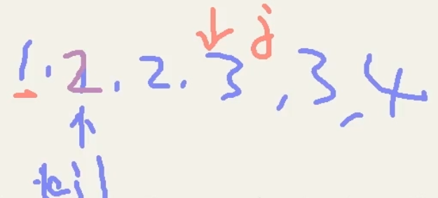

# 目录

[toc]

---

# 练习


## . 删除重复元素 | Remove Duplicates from Sorted Array
**题：** <sup style="color:#ccc">23-01 00:05:38~00:08:26</sup>


**思路：** <sup style="color:#ccc">23-01 00:08:28~00:14:58</sup>

</img>


**code：** <sup style="color:#ccc">23-02 00:00:08~00:01:34 Ex.1</sup>
[link](http://localhost:8888/notebooks/MyJupyterNote/old/23_____SlideWindows/22_01_.ipynb)
```python

```


---


## . 删除重复元素 2
**题：** <sup style="color:#ccc">23-02 00:02:07~00:03:01</sup>
上一题的基础上，要求最后返回的数组中重复数最多出现两次


**思路：** <sup style="color:#ccc">23-02 00:03:01~00:06:15</sup>


**code：** <sup style="color:#ccc">23-02 00:06:15~00:07:16 Ex.2</sup>
[link](http://localhost:8888/notebooks/MyJupyterNote/old/23_____SlideWindows/22_01_.ipynb)
```python

```


---


## . 
**题：** <sup style="color:#ccc"></sup>


**思路：** <sup style="color:#ccc"></sup>


**code：** <sup style="color:#ccc"> Ex.</sup>
[link]()
```python

```


---


## . 
**题：** <sup style="color:#ccc"></sup>


**思路：** <sup style="color:#ccc"></sup>


**code：** <sup style="color:#ccc"> Ex.</sup>
[link]()
```python

```


---


## . 
**题：** <sup style="color:#ccc"></sup>


**思路：** <sup style="color:#ccc"></sup>


**code：** <sup style="color:#ccc"> Ex.</sup>
[link]()
```python

```


---


## . 
**题：** <sup style="color:#ccc"></sup>


**思路：** <sup style="color:#ccc"></sup>


**code：** <sup style="color:#ccc"> Ex.</sup>
[link]()
```python

```


---


## . 
**题：** <sup style="color:#ccc"></sup>


**思路：** <sup style="color:#ccc"></sup>


**code：** <sup style="color:#ccc"> Ex.</sup>
[link]()
```python

```


---


## . 
**题：** <sup style="color:#ccc"></sup>


**思路：** <sup style="color:#ccc"></sup>


**code：** <sup style="color:#ccc"> Ex.</sup>
[link]()
```python

```


---


## . 
**题：** <sup style="color:#ccc"></sup>


**思路：** <sup style="color:#ccc"></sup>


**code：** <sup style="color:#ccc"> Ex.</sup>
[link]()
```python

```


---


## . 
**题：** <sup style="color:#ccc"></sup>


**思路：** <sup style="color:#ccc"></sup>


**code：** <sup style="color:#ccc"> Ex.</sup>
[link]()
```python

```


---