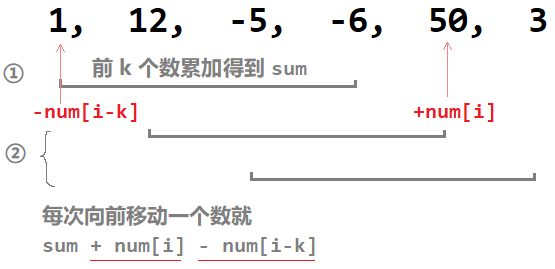

# 目录

[toc]

------------------------------------------------------

# 练习


## 1. 删除重复元素 | Remove Duplicates from Sorted Array
**题：** <sup style="color:#ccc">23-01 00:05:38~00:08:26</sup>

给定一个 **==排序==** 数组，<u>删除重复出现的元素</u>（只保留此元素的一个），
这样新的数组中每个元素只出现一次，并<u>返回这个新数组的长度</u>


**思路：** <sup style="color:#ccc">23-01 00:08:28~00:14:58</sup>

==这题实际上是双指针==

</img>
自己画过程中的变化，这题很简单，
到最后 i 指针前面的都是不重复的，所以可以直接返回 i+1 为数组长度

**code：** <sup style="color:#ccc">23-02 00:00:08~00:01:34 Ex.1</sup>
[link](http://localhost:8888/notebooks/MyJupyterNote/old/23_____SlideWindows/22_01_.ipynb)
```python
def removeDuplicates(lis):
    if not lis:
        return 0
    
    i = 0
    for j in range(1, len(lis)):
        if lis[j] != lis[i]:
            i += 1
            lis[i] = lis[j]
    return i+1
```


------------------------------------------------------


## 2. 删除重复元素 2
**题：** <sup style="color:#ccc">23-02 00:02:07~00:03:01</sup>
上一题的基础上，允许最后返回的数组中重复数最多出现两次


**思路：** <sup style="color:#ccc">23-02 00:03:01~00:06:15</sup>
==**记住： 
`i`指向的位置是下一个要置换正确数的位置。
`i`前面的位置表示已经置换好了的子数组**==
</img>

（如果动图思路跟不上可以自己去文件夹里面一张一张翻源图片）

**code：** <sup style="color:#ccc">23-02 00:06:15~00:07:16 Ex.2</sup>
[link](http://localhost:8888/notebooks/MyJupyterNote/old/23_____SlideWindows/22_01_.ipynb)
```python
def removeDuplicates2(nums):
    if not nums:
        return 0
    
    i = 0
    for j in range(len(nums)):
        if nums[i-2] != nums[j] or (i < 2):
            nums[i] = nums[j]
            i += 1
    return i
```


------------------------------------------------------


## 3. 删除元素 Remove Element
**题：** <sup style="color:#ccc">23-03 00:00:09~00:00:53</sup>

给定一个数组 **`nums`** 和一个值 **`val`**，
就地(**==in-place==**)删除这个 val 的所有实例，并返回新的数组的长度。
(注意没讲数组有没有排序)


**思路：** <sup style="color:#ccc">23-03 00:00:57~00:02:33</sup>

这个思路跟前面两题也是一样的，
==i 是下一个要置换的正确的数的位置==，
==i 前面的都是已经置换好的正确的子数组==。
那么你<u>只需要把不等于 val 的数都置换到 i 前面的子数组去就可以了</u>

**code：** <sup style="color:#ccc">23-03 00:02:35~ Ex.</sup>
[link]()
```python
def removeElement(nums, val):
    i = 0
    for j in range(len(nums)):
        if nums[j] != val:
            nums[i] = nums[j]
            i += 1
    return i
```


------------------------------------------------------


## 4. 每k个元素求一个平均值 | Maximum Average Subarray
**题：** <sup style="color:#ccc">23-04 00:00:08~00:06:27</sup>

给一个数组 nums, 一个窗口大小 k。
<u>要求你在 num 中每 k 个元素求一个平均值。</u>


（这题在银行中是比较常见的，他们需要知道到了月底手上还有多少现金流，根据手上的钱来做下一步决策。k 就相当于时间，多少个月。）

**思路：** <sup style="color:#ccc">23-04 00:09:12~00::</sup>
1. 第一个 [1~k] 区间的值的总和 
2. 接下来，每向前移动一个值，就加上 `nums[i]`，减掉 `nums[i-k]`

</img>

**code：** <sup style="color:#ccc"> Ex.</sup>
[link]()
```python
def findMaxnumsverage(nums, k):
    moving_sum = 0.0
    # 1. 第一个 [1~k] 区间的值的总和
    for i in range(k):
        moving_sum += nums[i]
    
    # 2. 接下来，每向前移动一个值，就加上 nums[i]，减掉 nums[i-k]
    res = moving_sum
    for i in range(k, len(nums)):
        moving_sum += nums[i] - nums[i-k]
        res = max(res, moving_sum)  # 挑大的那个？？
    return (res / k)


nums = [1, 12, -5, -6, 50, 3]
ret = findMaxnumsverage(nums, 4)
```


------------------------------------------------------


## 5. 最长的连续的、递增的子数组的长度 | Longest Continuous Increasing Subsequence
**题：** <sup style="color:#ccc"></sup>
`Given an unsorted array of integers, `
`find the length of longest continuous increasing subsequence(subarray)`
给你一个没有排序的数组，
要求你在数组中找到最长的 **连续的**、**递增的** 子数组的<u>**长度**</u>。


**思路：** <sup style="color:#ccc">23-05 00:00:03~00::</sup>
1. maintain 一个 **`left`**，一个 **`right`**。
   **`left`**(`min`)到 **`right`**(`max`) 必须是递增的
2. ==下一个数一定要比 **`right`** 大才能继续构成连续==
   否则重新算，既这个数为新的 **`left`**

**code：** <sup style="color:#ccc"> Ex.</sup>
[link]()
```python
def findLengthOfLCIS(nums):
    count = 1       # 局部长度
    max_count = 1   # 全局最大长度
    for i in range(1, len(nums)):   # 从第 2 个开始比
        if nums[i] > nums[i-1]:
            count += 1
            max_count = max(count, max_count)
        else:
            count = 1
    return max_count

nums = [1, 3, 5, 4, 7]
ret = findLengthOfLCIS(nums)
```


------------------------------------------------------

## 6. 大于s的最小的连续的子数组的长度 | Minimum Size Subarray Sum（模板）
<!-- 6_Minimum_Size_Subarray_Sum -->

**题：** <sup style="color:#ccc"></sup>

`Given an array of n positive integers and a positive integer s, `
`find the minimal length of a contiguous subarray of which the sum >= s. `
`If there isn't one, return 0 instead`

给你一个正整数数组，一个整数 s,
要求找到能够大于 s 的 **最小的连续的子数组** 的长度。
没有就返回 0。

Example：
Given the array `[2, 3, 1, 2, 4, 3]` and `s = 7`
the subarray `[4, 3]` has the minimal length under the problem constraint


**思路：** <sup style="color:#ccc">23-06 00:01:35</sup>

<br>

可能会问的点：<sup style="color:#ccc">23-06 00:05:41</sup>
1. 如何定义窗口。（什么是好窗口，坏窗口，什么时候打破窗口，恢复窗口
2. 什么时候移动左指针，什么时候移动右指针

模板：<sup style="color:#ccc">23-06 00:07:25</sup>
```py
# 两个 while 循环，
while j < len(nums):
    j += 1          # valid windows
    while ...:      # condition
        i += 1      # break windows

    ...
```
时间复杂度：<sup style="color:#ccc">23-06 00:08:56</sup>
注意，不是 `O(n^2)`, `i`, `j` 都各自只走了一遍数组长度，是 `O(n)`

**code：** <sup style="color:#ccc">23-06 00:09:36 Ex.</sup>
[link]()
```python

```


------------------------------------------------------


## . 
**题：** <sup style="color:#ccc"></sup>


**思路：** <sup style="color:#ccc"></sup>


**code：** <sup style="color:#ccc"> Ex.</sup>
[link]()
```python

```


------------------------------------------------------


## . 
**题：** <sup style="color:#ccc"></sup>


**思路：** <sup style="color:#ccc"></sup>


**code：** <sup style="color:#ccc"> Ex.</sup>
[link]()
```python

```


------------------------------------------------------


## . 
**题：** <sup style="color:#ccc"></sup>


**思路：** <sup style="color:#ccc"></sup>


**code：** <sup style="color:#ccc"> Ex.</sup>
[link]()
```python

```


------------------------------------------------------


## . 
**题：** <sup style="color:#ccc"></sup>


**思路：** <sup style="color:#ccc"></sup>


**code：** <sup style="color:#ccc"> Ex.</sup>
[link]()
```python

```


------------------------------------------------------


## . 
**题：** <sup style="color:#ccc"></sup>


**思路：** <sup style="color:#ccc"></sup>


**code：** <sup style="color:#ccc"> Ex.</sup>
[link]()
```python

```


------------------------------------------------------


## . 
**题：** <sup style="color:#ccc"></sup>


**思路：** <sup style="color:#ccc"></sup>


**code：** <sup style="color:#ccc"> Ex.</sup>
[link]()
```python

```


------------------------------------------------------


## . 
**题：** <sup style="color:#ccc"></sup>


**思路：** <sup style="color:#ccc"></sup>


**code：** <sup style="color:#ccc"> Ex.</sup>
[link]()
```python

```


------------------------------------------------------


## . 
**题：** <sup style="color:#ccc"></sup>


**思路：** <sup style="color:#ccc"></sup>


**code：** <sup style="color:#ccc"> Ex.</sup>
[link]()
```python

```


------------------------------------------------------


## . 
**题：** <sup style="color:#ccc"></sup>


**思路：** <sup style="color:#ccc"></sup>


**code：** <sup style="color:#ccc"> Ex.</sup>
[link]()
```python

```


------------------------------------------------------


## . 
**题：** <sup style="color:#ccc"></sup>


**思路：** <sup style="color:#ccc"></sup>


**code：** <sup style="color:#ccc"> Ex.</sup>
[link]()
```python

```


------------------------------------------------------


## . 
**题：** <sup style="color:#ccc"></sup>


**思路：** <sup style="color:#ccc"></sup>


**code：** <sup style="color:#ccc"> Ex.</sup>
[link]()
```python

```


------------------------------------------------------


## . 
**题：** <sup style="color:#ccc"></sup>


**思路：** <sup style="color:#ccc"></sup>


**code：** <sup style="color:#ccc"> Ex.</sup>
[link]()
```python

```


------------------------------------------------------


## . 
**题：** <sup style="color:#ccc"></sup>


**思路：** <sup style="color:#ccc"></sup>


**code：** <sup style="color:#ccc"> Ex.</sup>
[link]()
```python

```


------------------------------------------------------