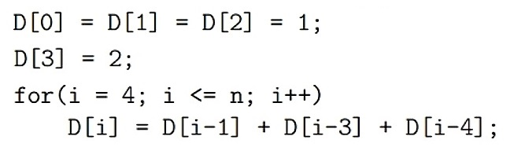
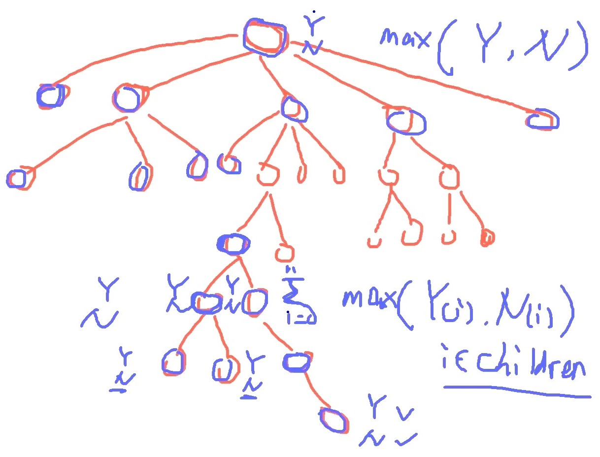
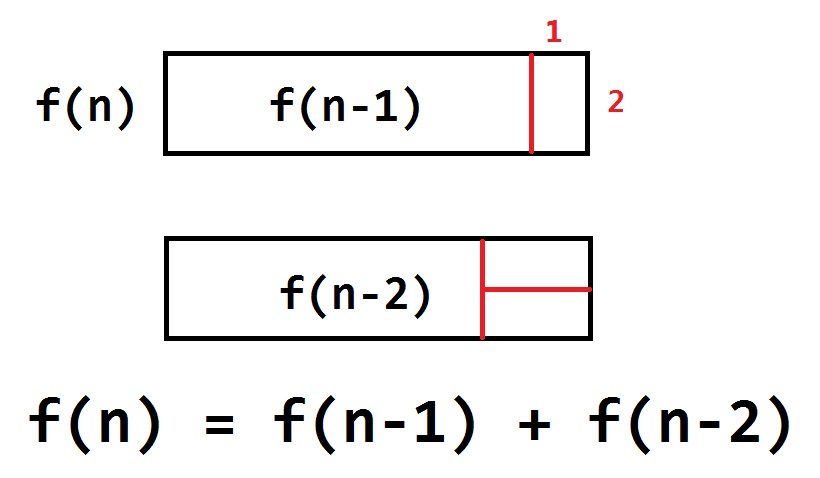
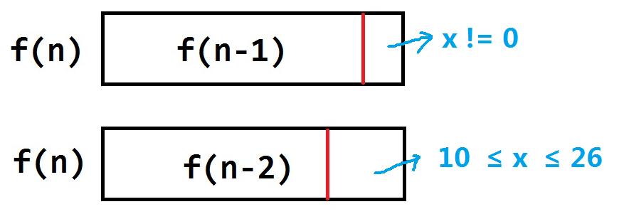
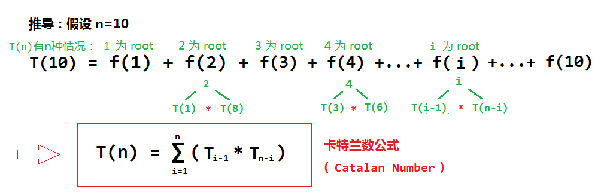
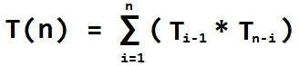

# 目录

[toc]

---

# 动态规划 dp (dynamic programming)

**什么是动态规划 ？**
- 与分治法类似，都是将大问题拆分为相同的子问题
- 不同的是：
  - 分治法是从上往下，计算所有子问题的结果最后一层一层合并的到大问题的结果
  - 动态规划是从下往上，**考虑到会有==相同的子问题==**，
    先计算出子问题的结果，==**大问题直接引用下层就算出来的子问题结果**==，极大的精简了计算量

**经典的 dp 问题**
- 斐波那契序列 f(n) = f(n-1) + f(n-2)
- 汉诺塔
- 子序列最大和

**求解动态规划问题的难点：**
1. ==**找到公式**==，然后直接复用。比如斐波那契的公式就是 **`f(n) = f(n-1) + f(n-2)`**
2. **先找到最小的 base**。 比如 **`f(1)=1, f(2)=1`**


---

# 练习

## 1. 给定的数求和的不同方式（Number Problem

[程式：Ex.1 Number Problem](http://39.100.240.159:1234/notebooks/24-26_Dynamic_Programming/23_01_DynamicProgramming.ipynb#Ex1)

**题：**
给一个 n, 求 1,3,4 相加得到 n 的所有相加方式

**思路：**<sup style="color:#ccc">24-03 00:04:00~</sup>
</img>


```python
def coin(n):
    dp = [0] * (n + 1)
    dp[0] = dp[1] = dp[2] = 1
    dp[3] = 2
    for i in range(4, n+1):
        # 由于是从下往上的原因，dp[i-1],dp[i-3],dp[i-4] 一定都是在上次循环中已经得到答案存入的 dp 数组的，所以计算速度会非常快
        dp[i] = dp[i-1] + dp[i-3] + dp[i-4]   # D(n) = D(n-1) + D(n-3) + D(n-4)
    return dp[n]

# ---------------------------------------------
# if __name__ == "__main__":
#     print(coin(5))      # 6
#     print(coin(10))     # 64
```
<br>


---
<!-- -------------------------------------------------------- -->

## 2. 入室抢劫（House Robber
[程式：Ex.2 House Robber](http://39.100.240.159:1234/notebooks/24-26_Dynamic_Programming/23_01_DynamicProgramming.ipynb#Ex2)

**题：**
你是一个小偷，盯上一排房子，相邻的房子若都被抢将触动报警系统，每个房子里面有多少钱你都调查清楚了，
求不触动报警系统的情况下怎样才能入室抢劫抢到最多钱？

**思路：**
```
选择抢这个房子时 = 不抢上一个房子的情况 + 这个房子抢到的钱
选择不抢这个房子 = ( 不抢上一个房子 or 抢上一个房子的情况 ) 哪个大选哪个
```
|     公式 \ 数组                              |   8   |  3    |   5   |  7    |    6  |  9    |  2    |
| ----                              | ---- | ---- | ---- | ---- | ---- | ---- | ---- |
|  不抢：`No(i)  = max(Yes[i-1], No[i-1]` |   0   |   8   |  8    |  13    |  15    |  19    |   24   |
| 抢：`Yes(i) = No(i-1) + lis[i]`       |  8    |   3   |  13    |   15   |  19    |  24    |    21  |

<br>

**正解：**
```python
# 时间复杂度：O(n), 空间复杂度：O(n)
def rob(nums):
    n = len(nums)
    dp = [ [0] * 2 for _ in range(n + 1)]       # [[0, 0], [0, 0], [0, 0], ...]
    for i in range(1, n+1):
        dp[i][0] = max(dp[i-1][0], dp[i-1][1])  # forget it
        dp[i][1] = nums[i-1] + dp[i-1][0]       # let's do it
    return max(dp[n][0], dp[n][1])

# ---------------------------------------------
# if __name__ == "__main__":
#     nums = [2, 7, 9, 3, 1]
#     print(rob(nums))
```


**改进：**
由于每一次我们都只需要上一次的而已，所以上上次、上上上次的都不要
```python
# 时间复杂度：O(n), 空间复杂度：O(1)
def rob(nums):
    yes, no = 0, 0
    for i in nums: 
        no, yes = max(no, yes), i + no
    return max(no, yes)

# ---------------------------------------------
# if __name__ == "__main__":
#     nums = [2,7,9,3,1]
#     print(rob(nums))
```

<br>


---
<!-- -------------------------------------------------------- -->

## 3. 入室抢劫（进阶）（House Robber II

[程式：Ex.3 House Robber II](http://39.100.240.159:1234/notebooks/24-26_Dynamic_Programming/23_01_DynamicProgramming.ipynb#Ex3)


**题：**
你是一个小偷，盯上一 **<u>圆形</u>** 排列的街道房子，相邻的房子若都被抢将触动报警系统，每个房子里面有多少钱你都调查清楚了，
求不触动报警系统的情况下怎样才能入室抢劫抢到最多钱？
<u></u>

**思路：**
```
将圆拉开变成直线，变形成上面那道题。
不同点在于: 抢了第1个房子的话就不能抢最后一个(第n个)房子（圆形头尾相邻）
```

**解：**
```python
def rob(nums):
    if len(nums) == 0:
        return 0
    if len(nums) == 1:
        return nums[0]
    return max(robRange(nums, 0, len(nums)-1), robRange(nums, 1, len(nums)))

def robRange(nums, start, end):         # helper
    yes, no = nums[start], 0
    for i in range(start + 1, end):
        no, yes = max(no, yes), i + no
    return max(no, yes)

# ---------------------------------------------
# if __name__ == "__main__":
#     nums = [2, 7, 9, 3, 1]
#     print(rob(nums))
```
<br>


---
<!-- -------------------------------------------------------- -->

## 4. 组织聚会（Planning Party **TODO**

[程式：Ex.4](http://39.100.240.159:1234/notebooks/24-26_Dynamic_Programming/23_01_DynamicProgramming.ipynb#Ex4)

**题：**
你是一个劫匪，实现知道一个公司开年会，你知道去的每个员工身上有多少钱

条件：抢了一个员工，就不能继续抢他的上级或者下属，否则大家将会互相通知来抓住你

求如何才能抢到最多钱？

**思路：**
从每一条分支的 叶子节点从下往上，按照上面一排房子的思路来解
对除了叶子节点的每一个 node 进行下面操作：
</img>
```py
抢当前节点   = 所有子节点都不抢的和 + 当前节点的值
不抢当前节点 = 所有子节点求和（max（每个子节点抢/不抢））

Yes(CurNode)= No(all childNode)加和 + CurNodeValue
No(CurNode) = max( Yes(i), No(i)(每个子节点抢/不抢的max) )加和 
```


TODO: 

这题没讲 code 自己尝试按照思路写一下


```python

```
<br>
<br>
<br>


---
<!-- -------------------------------------------------------- -->

## 5. 瓷砖问题（Tile Problem

[程式：Ex.5](http://39.100.240.159:1234/notebooks/24-26_Dynamic_Programming/23_01_DynamicProgramming.ipynb#Ex5)

**题：**
给你一种 2*1 尺寸的瓷砖，要求你铺一块宽为 2，长为 n 的区域，求有几种铺法？


**思路：**
</img>

这题没讲 code 下面的 code 是自己写的
```python
def tails(n):
    dp = [1, 1]
    for i in range(2, n+1):
        result = dp[i-1] + dp[i-2]
        dp.append(result)
    return dp

# -----------------------------
# print(tails(6))
```

<br>
<br>


---
<!-- -------------------------------------------------------- -->

## 6. 最小台阶问题（Min Cost Climbing Stairs

[程式：Ex.6](http://39.100.240.159:1234/notebooks/24-26_Dynamic_Programming/23_01_DynamicProgramming.ipynb#Ex6)

**题目：**
有一个楼梯，需要你从最底下到最上面，你可以一次走一步或者一次走两步
限制：每一层楼梯都要交费，每层收费不同 (给一个数组 cost_lis 告诉每层收费)

求：如何走才话费最少？

**思路：**
这题原理与入室抢劫的原理是一样的，都是边走边算，只不过公式不同
```py
公式：
dp(i) = min( dp[i-2]+cost_lis[i-2], dp[i-1]+cost_lis[i-1] )
到第 i 层台阶的花费 = ( 跨了 1 个台阶上来的的花费 or 垮了 2 个台阶上来的花费 ) 哪个花费小选哪个

其中：
跨了 1 台阶上来的的花费 = cost_lis[i-1] + dp[i-1] ：( 前面那个台阶的花费+到前面那个台阶之前的花费总和 )
垮了 2 个台阶上来的花费 = cost_lis[i-2] + dp[i-2] ：( 前面那个台阶的花费+到前面那个台阶之前的花费总和 )
```

**解：**
```python
# 解
# 时间复杂度：O(n), 空间复杂度：O(n)
def minCostClimbingStairs(cost_lis):
    n = len(cost_lis) + 1
    dp = [0] * n            # dp 数组: 到达第 i 个台阶所需要的花费
    for i in range(2, n):   # i = 2,3,4,...,n-1
        dp[i] = min(dp[i-2] + cost_lis[i-2], dp[i-1] + cost_lis[i-1])   # dp[i] : 到达第 i 个台阶所需要的花费
    return dp[-1]

# ---------------------------------------------------
# if __name__ == "__main__":
#     cost_lis = [1, 100, 1, 1, 1, 100, 1, 1, 100, 1]
#     ret = minCostClimbingStairs(cost_lis)
#     print(ret)
```

**改进**：空间复杂度
```python
# 解 2
# 时间复杂度：O(n), 空间复杂度：O(1)
def minCostClimbingStairs2(cost_lis):
    dp0, dp1, dp2 = 0, 0, 0
    for i in range(2, len(cost_lis)+1):   # i = 2,3,4,...,n-1
        dp2 = min(dp0 + cost_lis[i-2], dp1 + cost_lis[i-1])
        dp0, dp1 = dp1, dp2     # 为下一轮更新前两级台阶的花费
    return dp2

# ---------------------------------------------------
# if __name__ == "__main__":
#     cost_lis = [1, 100, 1, 1, 1, 100, 1, 1, 100, 1]
#     ret = minCostClimbingStairs2(cost_lis)
#     print(ret)
```
<br>
<br>


---
<!-- -------------------------------------------------------- -->

## 7. 求编码方式（Decode Way

[程式：Ex.7](http://39.100.240.159:1234/notebooks/24-26_Dynamic_Programming/23_01_DynamicProgramming.ipynb#Ex7)

**题：**
一段包含着 A-Z 的短信用以下方式进行编码：
```
'A' -> 1 
'B' -> 2 
... 
'Z' -> 26 
```

要求：给定一段编码的短信，求编码的方式有几种：
```
Input: "12"
Output: 2
Explanation: It could be decoded as "AB" (1 2) or "L" (12).

Input: "226"
Output: 3
Explanation: It could be decoded as "BZ" (2 26), "VF" (22 6), or "BBF" (2 2 6).
```

**思路：**

</img>

**解：**
```python
# 解
def numDecodings(string):
    if string == '' or string[0] == '0':
        return 0
    dp = [1, 1]                             # 前面的不用算，从 2 才开始算
    for i in range(2, len(string)+1):       # i: 2, 3, 4, ..., len(string)
        result = 0                          # if it is 0, then dp[i]=0
        if 10 <= int(string[i-2: i]) <= 26: # 任何两个相邻数字的值在 [10,26] 范围内
            result = dp[i - 2]
        if string[i - 1] != '0':
            result += dp[i - 1]             # 任何一个数字的值不等于 0
        dp.append(result)
    return dp[len(string)]

# -----------------------------------
# if __name__ == "__main__":
#     ret = numDecodings("226")
#     print(ret)
```
<br>
<br>


---
<!-- -------------------------------------------------------- -->

## 8. 独特二叉树的搜索路径（Unique Binary Search Tree

[程式：Ex.8](http://39.100.240.159:1234/notebooks/24-26_Dynamic_Programming/23_01_DynamicProgramming.ipynb#Ex8)

**题：**
给定 n，用 1, 2..., n 来表达 Binary Search Tree，求有几种表达方式？

**思路：**

</img>

**重点：** 
此题为 ==**卡特兰特**== 公式应用。Catalan 公式 ： 

</img>


**解：**
```python
def numTrees(n):
    if n <= 2:
        return n
    sol = [0] * (n+1)       # dp 数组
    sol[0] = sol[1] = 1
    for i in range(2, len(n)+1):
        for left in range(0, i):
            sol[i] += (sol[left] * sol[i-1-left])
    return sol[n]

# ----------------------------------------
# if __name__ == "__main__":
#     ret = [numTrees(i) for i in range(1, 6)]
#     print(ret)
```
<br>


---

## 9. 最大子序列乘积（Maximum Product Subarray 

[程式：Ex.9](http://39.100.240.159:1234/notebooks/24-26_Dynamic_Programming/23_01_DynamicProgramming.ipynb#Ex9)

跟上面入室抢劫求和的思路差不多，也是 **边走边算**。
不同的是：
需要 maintain 一个 max, 一个 min (当负数*负数时会咸鱼翻身为max)

```python
# 解：
def maxProduct(nums):
    if len(nums) == 0:
        return 0
    maxinum = mininum = result = nums[0]    # init
    for i in range(1, len(nums)):           # i: 1, 2, 3, ..., len(nums)-1
        num1 = maxinum * nums[i]
        num2 = mininum * nums[i]
        maxinum, mininum = max(num1, num2, nums[i]), min(num1, num2, nums[i])
        result = max(result, maxinum)
    return 

# nums = [2,3,-2,4]
# ret = maxProduct(nums)
# print(ret)
```


