# 目录

[toc]

---

[转载！出处：互联网架构为什么要做服务化？](https://mp.weixin.qq.com/s?__biz=MjM5ODYxMDA5OQ==&mid=2651959519&idx=1&sn=065074b135fc9cb243abe897261e1a72&scene=21#wechat_redirect)

# 互联网架构为什么要做服务化？

## 一、互联网高可用架构，为什么要服务化？

**【服务化之前高可用架构】**

在服务化之前，互联网的高可用架构大致是这样一个架构：

1）用户端是浏览器 browser，APP 客户端
2）后端入口是高可用的 nginx 集群，用于做反向代理
3）中间核心是高可用的 web-server 集群，研发工程师主要编码工作就是在这一层
4）后端存储是高可用的 db 集群，数据存储在这一层

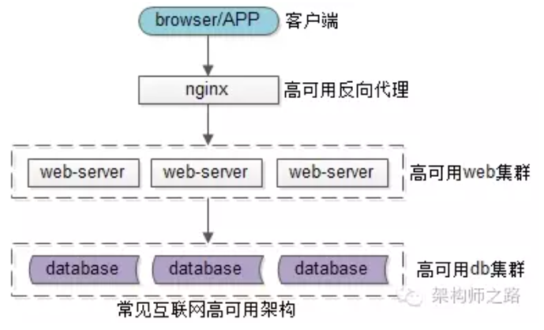</img>

更典型的， web-server 层是通过 DAO/ORM 等技术来访问数据库的。

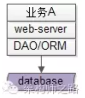</img>

可以看到，最初都是没有服务层的，此时架构会碰到一些什么痛点呢？

 

### 架构痛点一：代码到处拷贝

举一个最常见的业务的例子->用户数据的访问，
绝大部分公司都有一个数据库存储用户数据，各个业务都有访问用户数据的需求：

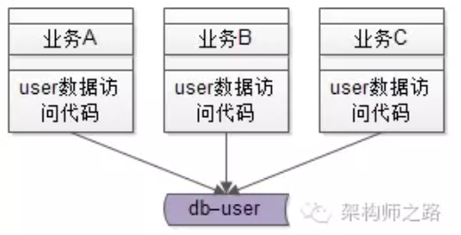</img>

在有用户服务之前，各个业务线都是自己通过 DAO 写 SQL 访问 user 库来存取用户数据，
这无形中就导致了代码的拷贝。

 

### 架构痛点二：复杂性扩散

随着并发量的越来越高，用户数据的访问数据库成了瓶颈，
<u>需要加入缓存来降低数据库的读压力</u>，于是架构中引入了缓存，
由于没有统一的服务层， **<u>各个业务线都需要关注缓存的引入</u>** 导致的复杂性：

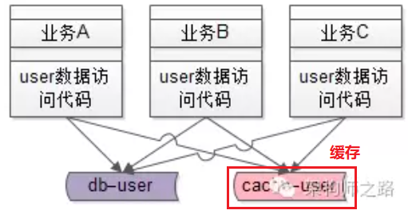</img>

对于用户数据的写请求，所有业务线都要升级代码：

（1）先淘汰 cache
（2）再写数据

对于用户数据的读请求，所有业务线也都要升级代码：

（1）先读 cache，命中则返回
（2）没命中则读数据库
（3）再把数据放入 cache

这个复杂性是典型的 <u>“业务无关” 的复杂性，业务方需要被迫升级。</u>

 

随着数据量的越来越大，数据库需要进行水平拆分，于是架构中又引入了分库分表，
由于没有统一的服务层，**<u>各个业务线都需要关注分库分表的引入</u>** 导致的复杂性：

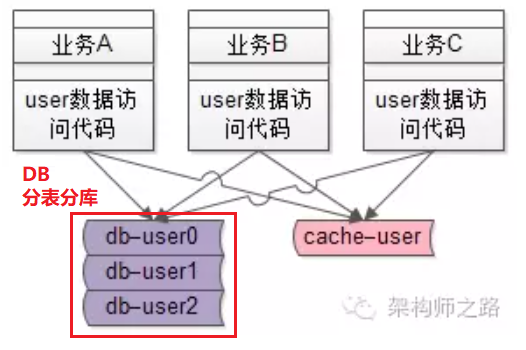</img>

这个复杂性也是典型的“业务无关”的复杂性，业务方需要被迫升级。

**==包括 bug 的修改，发现一个 bug，多个地方都需要修改。==**

 

### 架构痛点三：库的复用与耦合

服务化并不是唯一的解决上述两痛点的方法，
<u>**抽象出统一的 “库”**</u> 是最先容易想到的解决 <u>代码拷贝、复杂性扩散</u> 的方法。

抽象出一个 **`user.so`** ，负责整个用户数据的存取，从而避免代码的拷贝。
至于复杂性，也只有 `user.so` 这一个地方需要关注了。

解决了旧的问题，会引入新的问题，库的版本维护与业务线之间代码的耦合：

业务线 A 将 user.so <u>由版本 1 升级至版本 2 </u>，
如果不兼容业务线 B 的代码，会导致 B 业务出现问题； 
业务线 A 如果通知了业务线 B 升级，则是的业务线 B 会无故做一些“自身业务无关”的升级，非常郁闷。
当然，如果各个业务线都是拷贝了一份代码则不存在这个问题。

 

### 架构痛点四：SQL质量得不到保障，业务相互影响 

业务线通过 DAO 访问数据库：

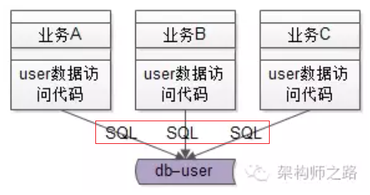</img>

本质上 SQL 语句还是各个业务线拼装的，
资深的工程师写出高质量的 SQL 没啥问题，<u>经验没有这么丰富的工程师可能会写出一些低效的 SQL</u> 。
假如业务线 A 写了一个全表扫描的 SQL ，导致数据库的 CPU100% ，
影响的不只是一个业务线，而是所有的业务线都会受影响。

 

### 架构痛点五：疯狂的 DB 耦合

业务线不止访问 user 数据，还会结合自己的业务访问自己的数据：

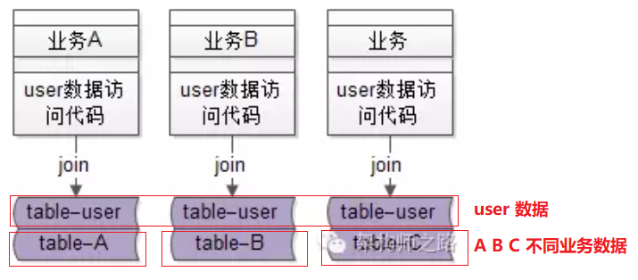</img>

典型的，通过 join 数据表来实现各自业务线的一些业务逻辑。 
这样的话，业务线 A 的 table-user 与 table-A 耦合在了一起，
业务线 B 的 table-user 与 table-B 耦合在了一起，
业务线 C 的 table-user 与 table-C 耦合在了一起，
结果就是： **<u>table-user ， table-A ， table-B ， table-C 都耦合在了一起。 </u>**

**<u>随着数据量的越来越大，业务线 ABC 的数据库是无法垂直拆分开的，
必须使用一个大库</u>**（疯了，一个大库 300 多个业务表 =_= ）。

 

架构痛点六：…

 

## 二、服务化解决什么问题？

为了解决上面的诸多问题，互联网高可用分层架构演进的过程中，引入了“服务层”。

以上文中的 **<u>用户业务</u>** 为例，引入了 **`user-service`**，对业务线 **响应所用用户数据的存取** 。

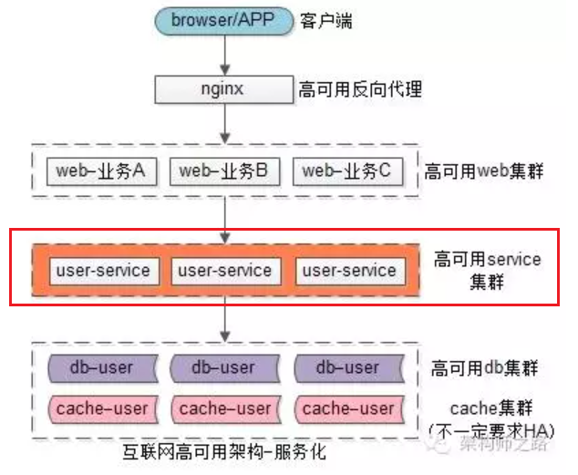</img>

引入服务层有什么好处，解决什么问题呢？

### 好处一：调用方爽 

有服务层之前：业务方访问用户数据，需要通过 DAO 拼装 SQL 访问 

有服务层之后：业务方通过 RPC 访问用户数据，
就像调用一个本地函数一样，非常之爽 **`User = UserService::GetUserById(uid);`** 
<u>传入一个 uid ，得到一个 User 实体</u>，就像调用本地函数一样，
不需要关心序列化，网络传输，后端执行，网络传输，范序列化等复杂性。

 

### 好处二：复用性，防止代码拷贝 

这个不展开叙述，所有 user 数据的存取，都通过 user-service 来进行，
**==代码只此一份==**，不存在拷贝。 升级一处升级，<u> bug 修改一处修改</u>。

 

### 好处三：专注性，屏蔽底层复杂度

- 在没有服务层之前，所有业务线都需要关注缓存、分库分表这些细节。
- 在有了服务层之后，只有服务层需要专注关注底层的复杂性了，向上游屏蔽了细节。

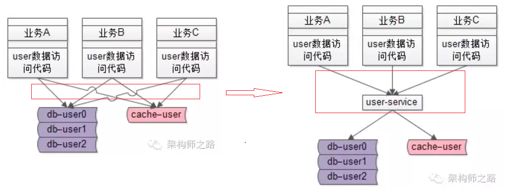</img>

### 好处四：SQL质量得到保障

- 原来是业务向上游直接拼接 SQL 访问数据库。
- 有了服务层之后，所有的 SQL 都是服务层提供的，业务线不能再为所欲为了。
底层服务对于稳定性的要求更好的话，可以由更资深的工程师维护，
而不是像原来 SQL 难以收口，难以控制。

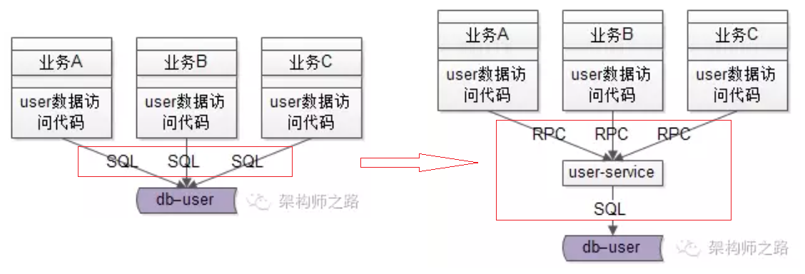</img>

 

### 好处五：数据库解耦

- 原来各个业务的数据库都混在一个大库里，相互 join，难以拆分。
- 服务化之后，**底层的数据库被隔离开了**，可以很方便的拆分出来，进行扩容。

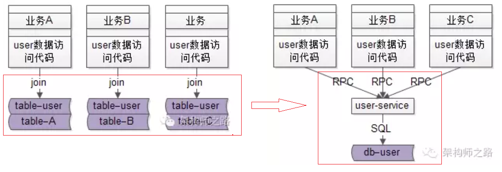</img>

### 好处六：提供有限接口，无限性能 

在服务化之前，各业务线上游想怎么操纵数据库都行，
遇到了性能瓶颈，各业务线容易扯皮，相互推诿。

服务化之后，服务只提供有限的通用接口，
理论上服务集群能够提供无限性能，性能出现瓶颈，服务层一处集中优化。

 
 

**好处七：…**

 

## 三、其他

服务化的其他好处，以及带来的问题，欢迎大家畅所欲言，我下期再来补充。

 

下期和大伙聊聊怎么“微”才是“微服务”，以及服务化的常见实践。

帮忙随手转发哟。

              

 

<u></u>

**<u></u>**

**====**

