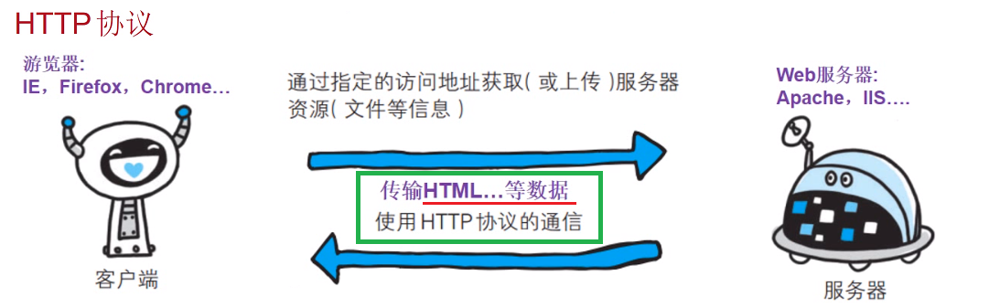
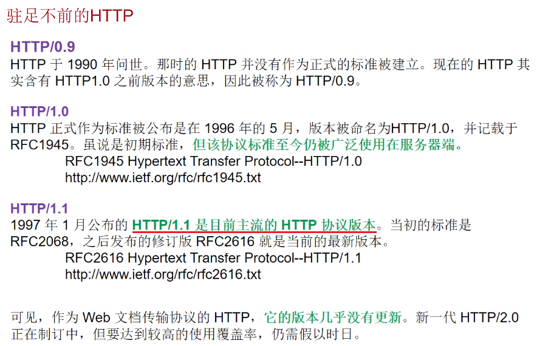
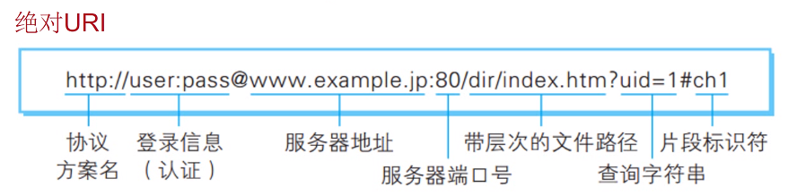

[toc]

---

# HTTP 协议

[link 05:40](https://www.bilibili.com/video/BV17b411W78h?p=15)
Web 使用一种名为 HTTP 的协议作为规范，完成从客户端到服务器端等一系列运作流程。 
Web 是建立在 HTTP( TCP/80 ) 协议上通信的。

**HTTP**（HyperTet Transfer Protocol，超文本 **==传输协议==**）
**HTML**（超文本标记语言）

</img>
**==即一头客户端，一头服务端，HTTP 就是两者之间传输 HTML 等数据时使用的协议==**

 

[link 23:31](https://www.bilibili.com/video/BV17b411W78h?p=15)
</img>

 

## URI 与 URL

[link 25:37](https://www.bilibili.com/video/BV17b411W78h?p=15)
- **URI**（统一资源标识符）
- **URL**（Uniform Resourceorator ，统一资源定位符）。 
使用 Web 浏览器等访问 Web 页面时需要输入的网页地址。

URI 用字符串标识某一互联网 <u>**资源**</u>，而 URL 表示资源的 <u>**地点**</u>（互联网上所处的位置）。
可见 **==URL 是 URI 的子集==**。
URL 就是一种具体的 URI ，即 URL 可以用来标识一个资源，而且还指明了如何 locate 这个资源。

URI 是以一种抽象的，高层次概念定义统一资源标识，而 URL 则是具体的资源标识的方式。 
<u>**URL 就是 URI 的一种**</u>。

### URI

[link 27:20](https://www.bilibili.com/video/BV17b411W78h?p=15)

URI 是 **U**niform **R**esource **I**dentifier 的缩写。 
RFC2396 分别对这 3 个单词进行了如下定义。

- **`Uniform`**
规定 <u>**==统一的格式==**</u> 可方便处理多种不同类型的资源，而不用根据上下文环境来识別资源指定的访问方式。
另外，加入新增的协议方案（如 http 或 ftp ：也更容易。
- **`Resource`**
资源的定义是 **“可标识的任何东西”** 。
除了文档文件、图像或服务（例如当天的天气预报）等能够区别于其他类型的，全都可作为资源。
另外，资源不仅可以是单一的，也可以是多数的集合体
- **`Identifier`**
表示可标识的对象。也称为标识符

</img>

[看到 35:39](https://www.bilibili.com/video/BV17b411W78h?p=15)

 
      

[link :](https://www.bilibili.com/video/BV17b411W78h?p=15)
[link :](https://www.bilibili.com/video/BV17b411W78h?p=15)
[link :](https://www.bilibili.com/video/BV17b411W78h?p=15)
[link :](https://www.bilibili.com/video/BV17b411W78h?p=15)
[link :](https://www.bilibili.com/video/BV17b411W78h?p=15)
[link :](https://www.bilibili.com/video/BV17b411W78h?p=15)

<u></u>
<u>****</u>
<u>====</u>
**====**
<u>**====**</u>