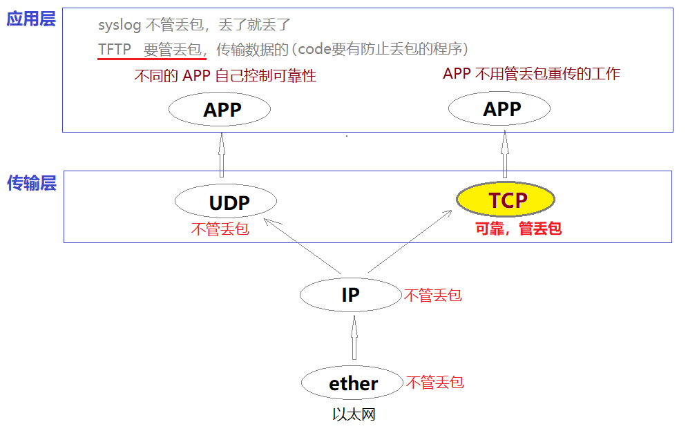
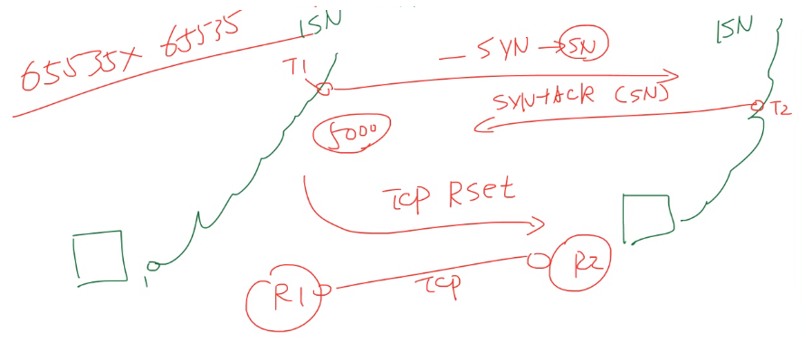

# TCP 简介

[link 01:32](https://www.bilibili.com/video/BV17b411W78h?p=11)

## 确认可靠性

可靠性：信息的传输会不会丢包，丢了包之后有没有重传，保证信息的完整到达。

- **UDP**

UDP 是一种没有复杂控制，提供 **面向无连接** 通信服务的一种协议。
换句话说，它 **将部分可靠性控制转移给应用程序 APP 去处理（例如TFTP）** ，
自己却只提供作为传输层协议的最基本功能。

- **TCP**

与 UDP 不同，TCP 则“人如其名 ", 可以说是对“传输、发送、通信”进行“控制”的“协议”。
它充分地实现了数据传输时各种控制功能，
可以进行 <u>丢包时的重发控制</u>、<u>丢弃重复收到的包</u>、<u>对次序乱掉的分包进行顺序控制</u>。
此外，TCP 作为一种<u>**面向有连接的协议，只有在确认通信对端存在时才会发送数据**</u>，
从而可以控制通信流量的浪费。
根据 TCP 的这些机制，<u>在 IP 这种无连接的网络上也能够实现高可靠性的通信</u>。（
相当于淘宝，我收不到货就不给你确认，你要给我重发）

**==确认可靠性有可能在应用层，也有可能在传输层==**

[link 02:30](https://www.bilibili.com/video/BV17b411W78h?p=11)
</img>

## 1.连接的管理

[link 06:27](https://www.bilibili.com/video/BV17b411W78h?p=11)

UDP 是一种 <u>**==面向无连接==**</u> 的通信协议，因此不检查对端是否可以通信，直接将 UDP 包发送出去。 
TCP 提供 <u>**==面向有连接==**</u> 的通信传输。
面向有连接是指在数据通信开始之前先做好通信两端之间的准备工作。

TCP 会在数据通信之前，
通过 <u>TCP 首部</u> 发送一个 **==SYN 包==** 作为建立连接的请求等待确认应答。
如果对端发来确认应答，则认为可以进行数据通信。
如果对端的确认应答未能到达，就不会进行数据通信。
此外，在通信结束时会进行断开连接的处理（**==FIN 包==**）。

可以使用 **TCP 首部** 用于控制的字段来管理 TCP 连接，
一个连接的 **==建立==** 与 **==断开==**，正常过程至少需要来回发送 <u>7 个</u>包能完成。(<u>3次</u>握手+<u>4次</u>挥手)

[link 07:47](https://www.bilibili.com/video/BV17b411W78h?p=11)
</img>

[link 08:45](https://www.bilibili.com/video/BV17b411W78h?p=11)

</img>

### **三次握手 四次挥手**
[link 09:25](https://www.bilibili.com/video/BV17b411W78h?p=11)

</img>

## 2.通过序列号与确认应答提高可靠性

在 TCP 中，当发送端的数据到达接收主机时，<u>**接收端主机会返回一个 ==已收到消息 (ACK)== 的通知**</u>。
这个消息叫做确认应答 (ACK).

通常，两个人对话时，在谈话的停顿处可以点头或询问以确认谈话内容。
<u>如果对方退退没有任何反馈，说话的一方还可以 **再重复一遍** 以保证对方确实听到。</u>
因此，对方是否理解了此次对话内容，对方是否完全听到了对话的内容，都要靠对方的反应来判断。

网络中的“确认应答”就是类似这样的一个概念。
<u>**当对方听懂对话内容时会说“嗯”，这就相当于返回了一个确认应答（ACK）**</u>。

[link 12:56](https://www.bilibili.com/video/BV17b411W78h?p=11)

**TCP ACK 确认工作示意图：**
</img>

## 3. 序列号简介

可能因为一些其他原因导致确认应答延迟到达，在源主机重发数据以后才到达的情况也履见不鲜。
此时，源发送主机只要按照机制重发数据即可。
但是对于目标主机来说，这简直是一种“灾难”。它会反复收到相同的数据。
而为了对上层应用提供可靠的传输，必须得 <u>放弃重复的数据包</u>。
为此，就必须人一种机制，<u>它能够识别 **是否已經接收数据**，又能够 **判断是否需要接收**。</u>

上述这些确认应答处理、重发控制以及重复控制等功能都可以通过序列号实现。
序列号是 **按顺序给发送 ==数据的每一个字节== 都标上号码的编号**。

[link 17:56](https://www.bilibili.com/video/BV17b411W78h?p=11)

</img>

<u>接收端通过查询接收数据 TCP 首部中的序列号和数据的长度，
将自己 **下一步应该接收的序列号作为确认应答** 返送回去。</u>[(19:23)](https://www.bilibili.com/video/BV17b411W78h?p=11)
就这样，通过序列号和确认应答号 TCP 可以实现可靠传输。
[link 20:38](https://www.bilibili.com/video/BV17b411W78h?p=11)
</img>

**序列号初始化 ( ISN )：** 
[link 21:57](https://www.bilibili.com/video/BV17b411W78h?p=11)
三次握手数据包、ISN 序列号
</img>

**序列号增长：** 
[link 26:00](https://www.bilibili.com/video/BV17b411W78h?p=11)
黑客攻击 TCP 方法
</img>

 

## 4.TCP 以段(**MSS**)为单位发送数据

### 最大消息长度 MSS
[link 30:51](https://www.bilibili.com/video/BV17b411W78h?p=11)
在建立 TCP 连接的同时，也可以确定发送数据包的单位，
这个单位也可以称其为 “ 最大消息长度 ”（ MSS: MaximunSegment Size)。
最理想的情况是，最大消息长度正好是 IP 中不会被分片处理的最大数据长度（一般为 1460=1500-20-20)

TCP 在传送大量数据时，是以 MSS 的大小将数据进行<u>分割发送</u>。
进行重发时也是以 MSS 为单位。

</img>

### MSS 协商

[link 35:19](https://www.bilibili.com/video/BV17b411W78h?p=11)
MSS 是在 <u>==**三次握手**==</u> 的时候，在两端主机之间被计算得出两端的主机在发出建立连接的请求时，
会在 TCP 首部中写人 MSS 选项，告诉对方自己的接口能够适应的 MSS 的大小。
然后会 <u>**在两者之间选择一个 ==较小的值== 投人使用**</u>

**MSS 协商示意图：**
</img>

 

## 5.滑动窗口技术简介 (1)

### 停止等待
[link 40:37](https://www.bilibili.com/video/BV17b411W78h?p=11)
TCP 以一个段为单位，每发一个段进行一次确认应答的处理
(<u>**发一个包等 ACK 确认，发一个包等 ACK 确认**</u>)。
这样的传输方式有一个缺点：**包的往返时间越长通信性能就越低**。

如下图。
</img>

## 5.滑动窗口技术简介 (2)

### 滑动窗口

[link 41:29](https://www.bilibili.com/video/BV17b411W78h?p=11)
为解決停止等待这个问题，TCP 引入了窗口这个概念。
即使在往返时间较长的情況下，它也能控制网络性能的下降。

如下图所示，确认应答不再是以每一个分段，
而是以更大的单位进行确认时，转发时间将会被大幅度的缩短。
也就是说，发送端主机，在发送了一个段之后不必要一直等待确认应答，
而是继续发送窗口大小就是指无需等待确认应答而可以继续发送数据的最大值。
下图中，窗口大小为4个段。
</img>

**==窗口大小其实就是你可以 <u>不用等我确认(ACK)</u>，能一口气发给我接收的数据大小。==**
但是你发到我的窗口值了就不能再发了，要等我这边处理完缓存里面的数据了，回给你 ACK 确认之后才能再发。

**注意：**
==窗口值是需要接收方告诉发送发的，是由接收方决定的。
因为窗口等同于接收方的缓存能力。==
 

## 5.滑动窗口技术简介 (3)
[link 44:50](https://www.bilibili.com/video/BV17b411W78h?p=11)

如右图所示，发送数据中高亮圈起的部分正是前面所提到的窗口。
**在这个窗口内的数据即便没有收到确认应答也可以继续发送。**

此外，从该窗口中能看到的数据因其某种数据己在传输中丢失，所以发送端无法收到确认应答，这种情况也需进行重发。
为此，**发送端主机在等到确认应答返回之前，必须在缓冲区中保留这部分数据**。

在滑动窗口以外的部分包括 尚未发送的数据、已经确认对端已收到的数据。
**当数据发出后若如期收到确认应答就可以不用再进行重发，此时数据就可以从缓存区清除。**
收到确认应答的情况下，将窗口滑动到确认应答中的序列号的位置。
这样可以 **<u>顺序地将多个段同时发送提高通信性能</u>**。
这种机制也被称为滑动窗口控制。

==**窗口是接收方的流控机制。**==

</img>

 

## 6.窗口控制与重发控制 (1)

[link 49:48](https://www.bilibili.com/video/BV17b411W78h?p=11)
在使用窗口控制中，如果出现段丢失该怎么办？

- **①** 首先，我们先考虑 ACK 确认应答未能返回的情况。

在这种情况下，**<u>==数据已经到达对端==，是不需要再进行重发的</u>**。
然而，在没有使用窗口控制的时候，没有收到确认应答的数据都会被重发。
而使用了窗口控制，就如下图所示，**<u>某些 ACK 确认应答即便丢失也无需重发</u>**。

</img>

## 6.窗口控制与重发控制 (2)

### 超时重传
[link 53:37](https://www.bilibili.com/video/BV17b411W78h?p=11)
</img>

### 快速重传（重复 ACK）
[link 51:23](https://www.bilibili.com/video/BV17b411W78h?p=11)
- **②** 其次，我们来考虑一下某个报文段丢失的情况。

如下图所示，接收主机如果收到一个自己应该接收的序号以外的数据时，会针对当前为止收到数据返回确认应答。
如下图所示。当某一报文段丢失后，发送端会一直收到序号为1001的确认应答，这个确认应答好像在提醒发送端“我想接收的是从1001开始的数据”。
因此，在窗口比较大，又出现报文段丢失的情況下，同一个序号的确认应答将会被重复不断地返回。而发送端主机如果连续3次收到同一个确认应答，就会将其所对应的数据进行童发。
这种机制比之前提到的超时管理更加高效，因此也被称作 **高速重发控制**。

</img>
 

### 滑动窗口工作流程

一共有 17 张工作流程图，点进链接看讲解 [link 01:39~21:32](https://www.bilibili.com/video/BV17b411W78h?p=12)
</img>

 

## 7.流控制（1)

[link 27:02](https://www.bilibili.com/video/BV17b411W78h?p=12)

（下面这段文字在上面的 **滑动窗口工作流程** 中有体现）

发送端根据自己的实际情况发送数据。
但是，接收端可能收到的是一个毫无关系的数据包又可能会在处理其他问题上花费一些时间。
因此在为这个数据包做其他处理时会耗费一些时间，甚至在高负荷的情况下无法接收任何数据。
如此一来，如果接收端将本应该接收的数据丢弃的话，就又会触发重发机制，从而导致网络流量的无端浪费。

为了防止这种现象的发生，TCP 提供一种机制
可以让 <u>**发送端根据接收端的实际接收能力控制发送的数据量**</u>。
这就是所谓的 <u>**流控制**（接收端的流控）</u>。
它的具体操作是，接收端主机向发送端主机通知自己可以接收数据的大小，
于是发送端会发送不超过这个限度的数据。
该大小限度就被称作窗口大小。
在上一节中所介绍的窗口大小的值就是由接收端主机决定的 

TCP 首部中，专门有一个字段用来通知窗口大小。
接收主机将自己可以接收的缓冲区大小（窗口值）放入这个字段中通知给发送端。
**<u>窗口值越大，说明网络的吞吐量越高。</u>**

不过，<u>接收端的这个缓冲区一且面临数据溢出时，
窗口大小的值也会随之被设置为一个更小的值通知给发送端，从而控制数据发送量</u>
（接收方缓存满了，告诉发起方不要发太多）。
也就是说，**<u>发送端主机会根据接收端主机的指示，对发送数据的量进行控制。
这也就形成了一个完整的TCP流控制（流量控制）。</u>**

**注意：**
**==TCP 是双向的，两个方向上都有流量，都有流控，都有滑动窗口。==**

 

### 窗口探测 and 窗口更新通知
[link 30:09](https://www.bilibili.com/video/BV17b411W78h?p=12)
- **窗口更新通知：**

当接收方长时间处理缓存中的数据，返回 ACK 的时候缓存满了窗口值为 0。
当处理一段时间之后缓存有空出空间了，需要通知发送方，这时候由于不能再继续返回 ACK 了，
就需要返回一个窗口更新通知告知发送方，可以继续发送数据了。

- **窗口探测：**

当接收方因为处理缓存时间过长，缓存一直处于满的状态时，或由于丢包问题，没有及时返回 ACK 或 窗口更新通知时，
**发送方**会发出 窗口探测 来询问接收方是否可以发送数据。

 

如右图所示，当接收端收到从3001号开始的数据段后其缓冲区即满，
不得不暂时停止接收数据（窗口为0)。
之后，在收到发送窗口更新通知后通信才得以继续进行。

如果这个窗口的更新通知在传送途中丢失，可能会导致无法继续通信。
为避免此类问题的发生，发送端主机会时不时的发送一个叫做窗口探测的数据段，
此数据段仅含个字节以获取最新的窗口大小信息。

</img>

## 8.拥塞控制 (1)
[link 35:51](https://www.bilibili.com/video/BV17b411W78h?p=12)
有了 TCP 的窗口控制，
收发主机之间即使不再以一个数据段为单位发送确认应答，也能够连续发送大量数据包。
然而，如果 <u>在通信刚开始时就发送大量数据。也可能会引发其他问题</u>。

一般来说，计算机网络都处在一个共享的环境。
因此也有可能会因为其他主机之间的通信使得网络拥堵。
<u>在网络出现拥堵时，如果突然发送一个较大量的数据，极有可能会导致整个网络的瘫痪</u>。

TCP 为了防止该间问题的出现，在通信一开始时就会通过一个叫做 <u>**慢启动**</u> 的算法得出的数值，
对发送数据量进行控制。

### 慢启动
[link 37:14](https://www.bilibili.com/video/BV17b411W78h?p=12)

首先，为了在发送端调节所要发送数据的量，定义了一个叫做 “拥塞窗口” 的概念。
**<u>拥塞窗口</u> 是发送方能够一口气发送的数据大小**。

于是在慢启动的时候，将这个拥塞窗口的大小设置为 1 个数据段（1MSS）发送数据，
**之后每收到一次确认应答（ACK）, 拥塞窗口的值就加 1**。

在发送数据包时，将 **拥塞窗口(发送方)** 的大小与接收端主机通知的 **窗口（接收方）** 大小 做比较，
然后按照它们当中较小那个值，**发送比其还要小的数据量**。

如果重发采用超时机制，那么拥塞窗口的初始值可以设置为 1 以后再进行慢启动修正。

有了上述这些机制，
就可以有效地减少通信开始时连续发包，导致的网络拥堵，
还可以避免网络拥塞情况的发生

</img>

### 慢启动阈值
[link 47:26](https://www.bilibili.com/video/BV17b411W78h?p=12)
不过，随着包的每次往返，拥塞窗口也会以1、2、4等指数函数的增长，
拥堵状况激增甚至导致网络拥塞的发生。

为了防止这些，引人了慢启动阈值的概念。
**只要拥塞窗口的值超出这个阀值，在每收到一次确认应答时，
只允许以下面这种比例放大拥塞窗口**：
</img>

TCP的通信开始时，并没有设置相应的慢启动阀值，
慢启动阀值的设置是 **==在超时重发时，才会设置为当时拥塞窗口一半的大小==**。

由重复确认应答而触发的 **高速重发**①与 **超时重发**② 机制的处理多少有些不同。
因为高速重发要求至少3次的 ACK 确认应答数据段到达对方主机后才会触发，
相比后者网络的拥堵要轻一些。
而由重复确认应答进行高速重发控制时，
**==<u>慢启动阀值的大小</u>被设置为当时窗口大小的一半。
然后将<u>窗口的大小</u>设置为该慢启动阀值+3个数据段的大小==**。

有了这样一种控制，TCP的拥塞窗口上图所示发生变化。
由于窗口的大小会直接影响数据被转发时的吞吐量，
所以一般情况下，窗口越大，越会形成高吞吐量的通信。

### 拥塞窗口的变化过程 
[link 49:53](https://www.bilibili.com/video/BV17b411W78h?p=12)

</img>

注意上图中 拥塞避免 是当用塞窗口的大小增长到当前的 慢启动阈值 之后的线性增长比例。
大小为：
</img>

看到 [link 56:22](https://www.bilibili.com/video/BV17b411W78h?p=12)

 
      

<u></u>
<u>****</u>
<u>====</u>
**====**