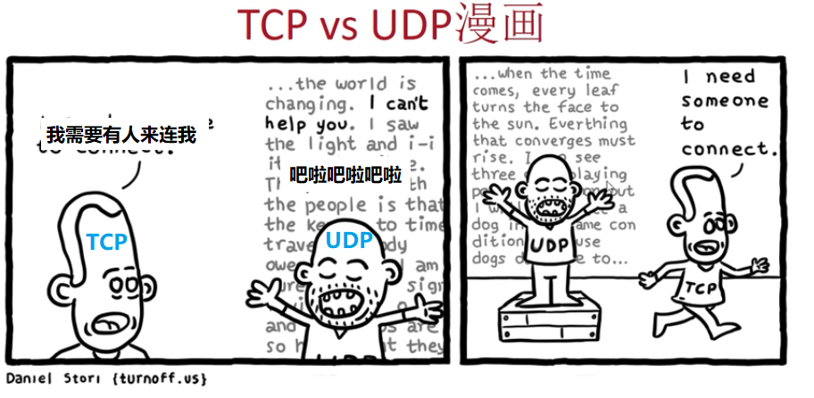
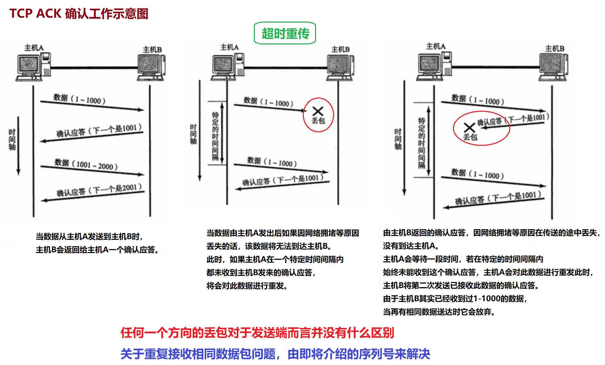

# TCP 简介

[不想看就直接去听课 01:32](https://www.bilibili.com/video/BV17b411W78h?p=11)

## 确认可靠性

可靠性：信息的传输会不会丢包，丢了包之后有没有重传，保证信息的完整到达。

- **UDP**

UDP 是一种没有复杂控制，提供 **面向无连接** 通信服务的一种协议。
换句话说，它 **将部分可靠性控制转移给应用程序 APP 去处理（例如TFTP）** ，
自己却只提供作为传输层协议的最基本功能。

- **TCP**

与 UDP 不同，TCP 则“人如其名 ", 可以说是对“传输、发送、通信”进行“控制”的“协议”。
它充分地实现了数据传输时各种控制功能，
可以进行 <u>丢包时的重发控制</u>、<u>丢弃重复收到的包</u>、<u>对次序乱掉的分包进行顺序控制</u>。
此外，TCP 作为一种<u>**面向有连接的协议，只有在确认通信对端存在时才会发送数据**</u>，
从而可以控制通信流量的浪费。
根据 TCP 的这些机制，<u>在 IP 这种无连接的网络上也能够实现高可靠性的通信</u>。（
相当于淘宝，我收不到货就不给你确认，你要给我重发）

**==确认可靠性有可能在应用层，也有可能在传输层==**

[link 02:30](https://www.bilibili.com/video/BV17b411W78h?p=11)
</img>

## 1.连接的管理

[link 06:27](https://www.bilibili.com/video/BV17b411W78h?p=11)

UDP 是一种 <u>**==面向无连接==**</u> 的通信协议，因此不检查对端是否可以通信，直接将 UDP 包发送出去。 
TCP 提供 <u>**==面向有连接==**</u> 的通信传输。
面向有连接是指在数据通信开始之前先做好通信两端之间的准备工作。

TCP 会在数据通信之前，
通过 <u>TCP 首部</u> 发送一个 **==SYN 包==** 作为建立连接的请求等待确认应答。
如果对端发来确认应答，则认为可以进行数据通信。
如果对端的确认应答未能到达，就不会进行数据通信。
此外，在通信结束时会进行断开连接的处理（**==FIN 包==**）。

可以使用 **TCP 首部** 用于控制的字段来管理 TCP 连接，
一个连接的 **==建立==** 与 **==断开==**，正常过程至少需要来回发送 <u>7 个</u>包能完成。(<u>3次</u>握手+<u>4次</u>挥手)

[link 07:47](https://www.bilibili.com/video/BV17b411W78h?p=11)
</img>

[link 08:45](https://www.bilibili.com/video/BV17b411W78h?p=11)

</img>

### **三次握手 四次挥手**
[link 09:25](https://www.bilibili.com/video/BV17b411W78h?p=11)

</img>

## 2.通过序列号与确认应答提高可靠性

在 TCP 中，当发送端的数据到达接收主机时，<u>**接收端主机会返回一个 ==已收到消息 (ACK)== 的通知**</u>。
这个消息叫做确认应答 (ACK).

通常，两个人对话时，在谈话的停顿处可以点头或询问以确认谈话内容。
<u>如果对方退退没有任何反馈，说话的一方还可以 **再重复一遍** 以保证对方确实听到。</u>
因此，对方是否理解了此次对话内容，对方是否完全听到了对话的内容，都要靠对方的反应来判断。

网络中的“确认应答”就是类似这样的一个概念。
<u>**当对方听懂对话内容时会说“嗯”，这就相当于返回了一个确认应答（ACK）**</u>。

[link 12:56](https://www.bilibili.com/video/BV17b411W78h?p=11)
</img>

## 3. 序列号简介

可能因为一些其他原因导致确认应答延迟到达，在源主机重发数据以后才到达的情况也履见不鲜。
此时，源发送主机只要按照机制重发数据即可。
但是对于目标主机来说，这简直是一种“灾难”。它会反复收到相同的数据。
而为了对上层应用提供可靠的传输，必须得 <u>放弃重复的数据包</u>。
为此，就必须人一种机制，<u>它能够识别 **是否已經接收数据**，又能够 **判断是否需要接收**。</u>

上述这些确认应答处理、重发控制以及重复控制等功能都可以通过序列号实现。
序列号是 **按顺序给发送数据的每一个 ==字节== 都标上号码的编号**。
<u>接收端通过查询接收数据 TCP 首部中的序列号和数据的长度，
将自己 **下一步应该接收的序列号作为确认应答** 返送回去。</u>
就这样，通过序列号和确认应答号 TCP 可以实现可靠传输。

[link 17:56](https://www.bilibili.com/video/BV17b411W78h?p=11)

 
      

<u></u>
<u>****</u>
<u>====</u>
**====**